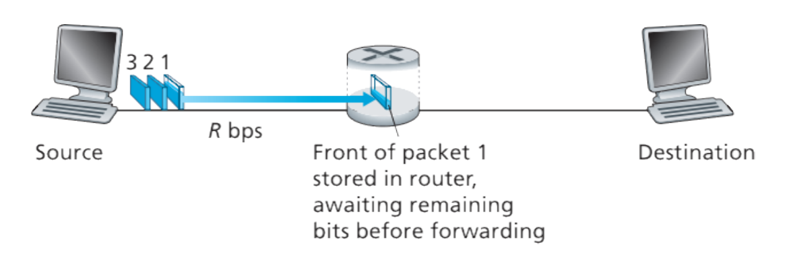
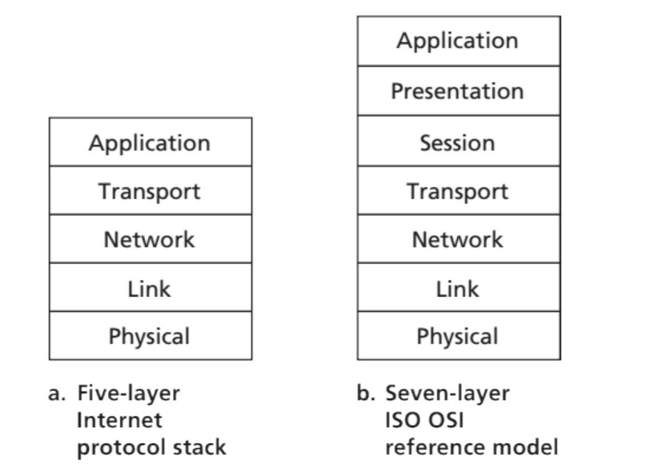

## Evaluation Criteria

* Scribe - 5%
* Weekly Quizzes - 20% 
* Mid term 1 - 15%
* Mid term 2 - 15%
* Final Exam - 45%
  
## Protocol

A protocol defines the format and the order of messages exchanged
between two or more communicating entities, as well as the actions taken
on the transmission and/or receipt of a message or other event.

## Packet Switching

* End systems exchange messages with each other.
* Long messages into smaller chunks of data known as packets.
* Between source and destination, each packet travels through
  communication links and packet switches
* Packets are transmitted over each communication link at a rate equal
  to the full transmission rate of the link. So, if a source end system or
  a packet switch is sending a packet of $L$ bits over a link with
  transmission rate $R$ bits/sec, then the time to transmit the packet is
  $L/R$ seconds.
* Each packet can transfer via different path.

### Store And Forward

Store-and-forward transmission means that the packet switch (router) must
receive the entire packet before it can begin to transmit the first bit of the packet onto the outbound link (Maybe because we need to process header). Router can store multiple packets.

**Question:** Consider a simple network consisting of two end systems connected by a single router, as shown in the figure. 

*Figure: [Kurose and Ross] Store-and-forward packet switching.*

All links in the above figure have transmission rate R bits/sec. The source wants to send 4
packets of L bits each to the destination. If the source starts transmission of the first packet
at time 0, at what time would the destination receive all the packets?

**Answer:** $2L/R + 3L/R = 5L/R$.

### Delay in Packet-Switched Networks

* **Processing Delay:** The time required to examine the packets header and determine where to direct the packet is part of the processing delay. The processing delay can also include other factors, such as the time needed to check for bit-level errors in the packet that occurred in transmitting the packets bits from the upstream node to router A. Processing delay in high-speed routers are typically on the order of microseconds or less. After this nodal processing, the router directs the packet to the queue that precedes the link to router B.
* **Queuing Delay:** At the queue, the packet experiences a queuing delay as it waits to be transmitted onto the link. The length
  of the queuing delay of a specific packet will depend on the number of earlier-arriving packets that are queued
  and waiting for transmission onto the link. If the queue is empty and no other packet is currently being
  transmitted, then our packets queuing delay will be zero. On the other hand, if the traffic is heavy and many
  other packets are also waiting to be transmitted, the queuing delay will be long.Queuing delays can be on
  the order of microseconds to milliseconds in practice.
* **Transmission Delay:** Assuming that packets are transmitted in a first-come-first-served manner, as is common in packet-switched networks, our packet can be transmitted only after all the packets that have arrived before it have been transmitted. Denote the length of the packet by $L$ bits, and denote the transmission rate of the link from router A to router B by $R$ bits/sec. The transmission delay is $L/R$. This is the amount of time required to push (that is, transmit) all of the packets bits into the link.
* **Propagation Delay:** Once a bit is pushed into the link, it needs to propagate to router B. The time required to propagate from the beginning of the link to router B is the propagation delay. The bit propagates at the propagation speed of the link. The propagation speed depends on the physical medium of the link. The propagation delay is the distance between two routers divided by the propagation speed. That is, the propagation delay is d/s, where d is the distance between router A and router B and s is the propagation speed of the link. Once the last bit of the packet propagates to node B, it and all the preceding bits of the packet are stored in router B. The whole process then continues with router B now performing the forwarding.

## Circuit Switching

* Resources needed along a path (buffers, link transmission rate) to provide for communication between the end systems are reserved for the duration of the communication session between the end systems.
* A circuit in a link is implemented with either frequency-division
  multiplexing (FDM) or time-division multiplexing (TDM).
* In **FDM**, the frequency spectrum of a link is divided up among the connections established across
  the link. Specifically, the link dedicates a frequency band to each connection for the duration of the
  connection.
* **TDM** is considered to be a digital procedure which can be employed when the transmission
  medium data rate quantity is higher than the data rate requisite of the transmitting and receiving devices.
  In TDM, corresponding frames carry data to be transmitted from the different sources. Each frame consists
  of a set of time slots, and portions of each source is assigned a time slot per frame.
* Circuit Switching is basically used for real time applications
* Packet switching is better than circuit switching as even traditional applications of circuit switching such as phone calls is now being done with the help of packet switching which even allows for both of the things, i.e. internet and phone call to happen simultaneously (VoLTE). Also it can easily accommodate more sporadic users without change in configuration.

## Protocol Layering

*Figure: [Kurose and Ross] The Internet protocol stack (a) and OSI reference model (b).*

Layer interacts with layers only next to it.

Benefits of layering:
* We can modify a layer freely, i.e. tweak it. 
* Layer acts as a wrapper which can be unwrapped at the other end.

