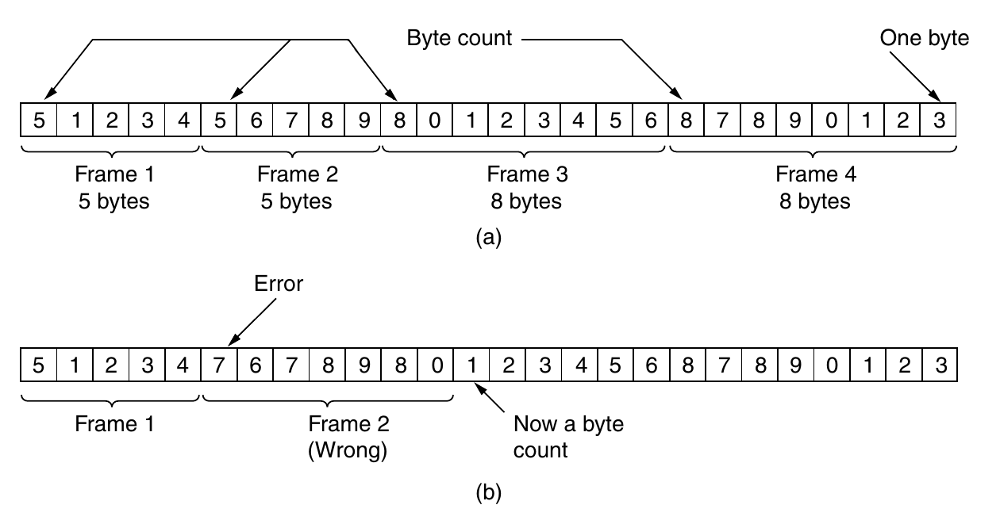
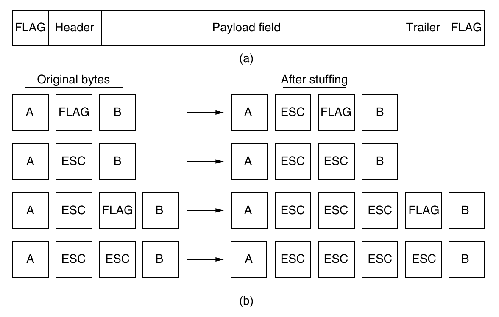
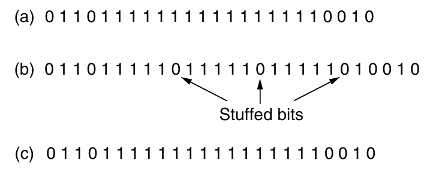
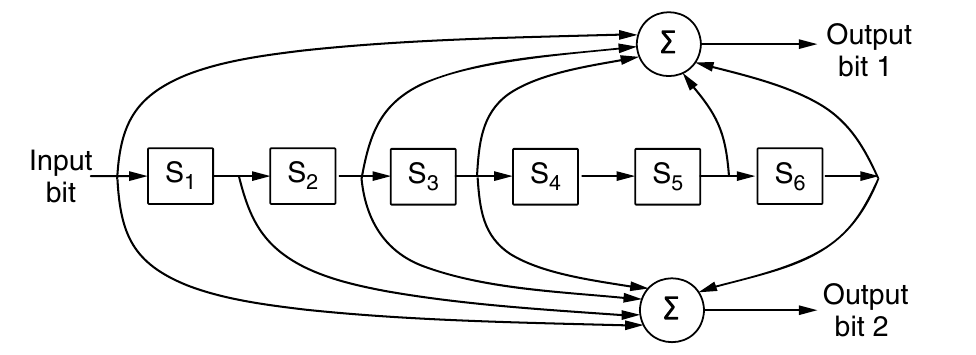
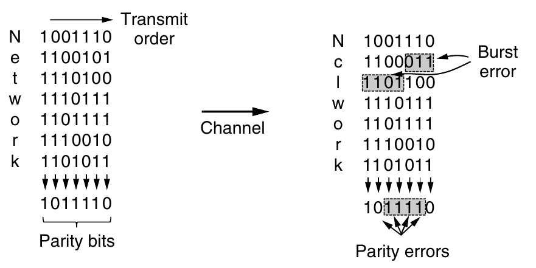
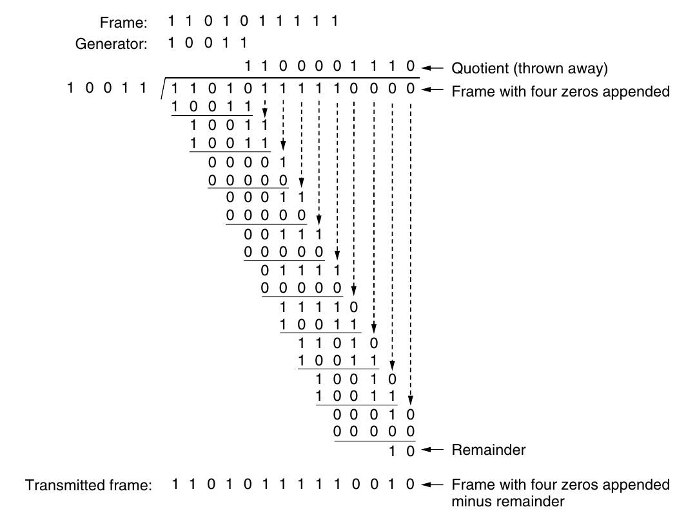
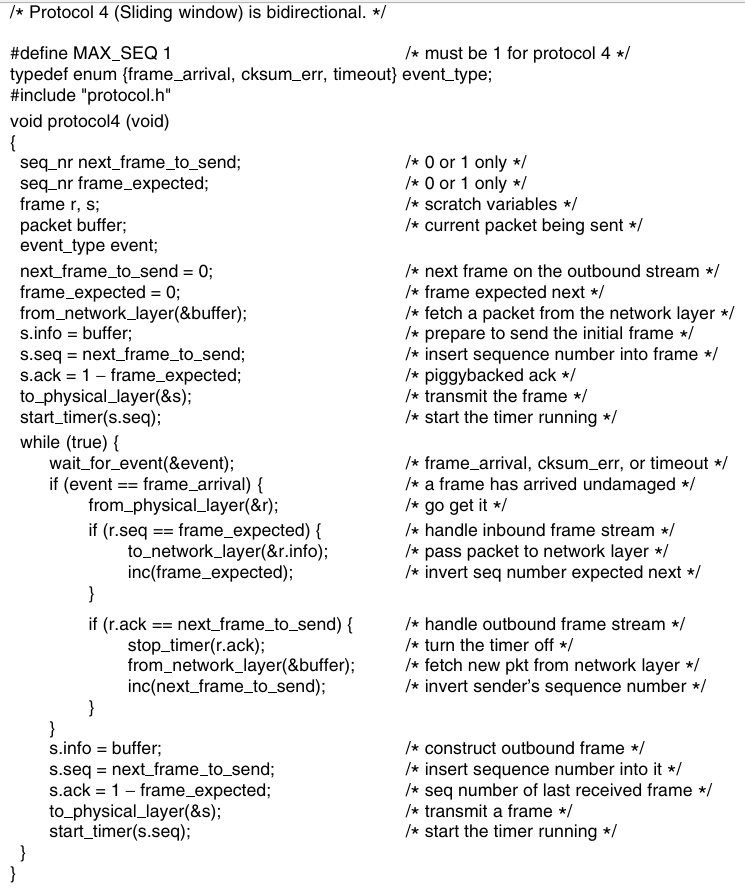
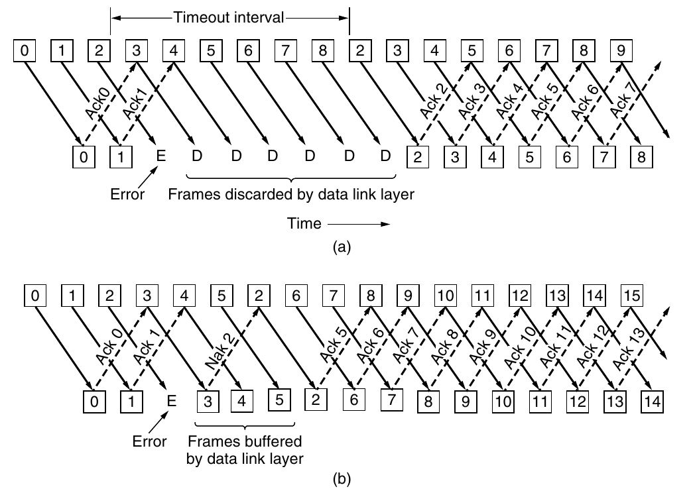

* We will refer to any device that runs a link-layer protocol as node.
* The communication channels that connect adjacent nodes along the communication path as links.
* In order to transfer data transferred from source node to destination node, it must be moved over each of the individual links in the end-to-end path.
* Transmitting nodes encapsulate datagram in a link-layer frame and transmits the frame into the link.

## Link Layer Services

* **Framing**: A frame consists of a data field, in which the network-layer
datagram is inserted, and a number of header fields.
* **Reliable delivery**: When a link-layer protocol provides reliable
delivery service, it guarantees to move each network-layer datagram
across the link without error.
* **Link access**: A medium access control (MAC) protocol specifies the
rules by which a frame is transmitted onto the link. For
point-to-point links, the MAC protocol is simple. The more
interesting case is when multiple nodes share a single broadcast
link—the so-called multiple access problem.
* **Error detection and correction**: The link-layer hardware in a
receiving node can incorrectly decide that a bit in a frame is zero
when it was transmitted as a one, and vice versa

## Framing

* The bit stream received by the data link layer is not guaranteed to be error free.
* It is up to the data link layer to detect and, if necessary, correct errors.
* Data link layer to break up the bit stream into discrete frames, compute a short token called a checksum for each frame, and include the checksum in the frame when it is transmitted.
* When a frame arrives at the destination, the checksum is recomputed. If the newly computed checksum is different from the one contained in the frame, the data link layer knows that an error has occurred and takes steps to deal with it.
* Four methods for Framing:
  * Byte count.
  * Flag bytes with byte stuffing.
  * Flag bytes with bit stuffing.
  * Physical layer coding violations.

### Byte count

*Figure [Tanenbaum] A byte stream (a) Without errors. (b) With one error*

### Flag bytes with byte stuffing

Two consecutive flag bytes indicate the end of one frame and the start of the next. 
Thus, if the receiver ever loses synchronization it can just search for two flag bytes to find the end of the current frame and the start of the next frame

*Figure [Tanenbaum] (a) A frame delimited by flag bytes. (b) Four examples of byte sequences before and after byte stuffing.*

$2B$ overhead.

### Flag bytes with bit stuffing

Each frame begins and ends with a special bit pattern, 01111110 or 0x7E in hexadecimal. This pattern is a flag byte. 

Whenever the sender’s data link layer encounters five consecutive 1s in the data, it automatically stuffs a 0 bit into the outgoing bit stream. 

When the receiver sees five consecutive incoming 1 bits, followed by a 0 bit, it automatically destuffs (i.e., deletes) the 0 bit.

*Figure [Tanenbaum] (a) The original data. (b) The data as they appear on the line. (c) The data as they are stored in the receiver’s memory after destuffing*

$B/5$ overhead. (But hard disks prefer byte reads and writes)

### Physical layer coding violations

* Encoding of bits as signals often includes redundancy to help the receiver.
* For example, in the 4B/5B line code 4 data bits are mapped to 5 signal bits to ensure sufficient bit transitions. We can use some reserved signals to indicate the start and end of frames.
* We are using “coding violations” to delimit frames.
* It is easy to find the start and end of frames and there is no need to stuff the data.

## Error Control

Having solved the problem of marking the start and end of each frame, we
come to the next problem: how to make sure all frames are eventually delivered to
the network layer at the destination and in the proper order.

For which we have seen, acknowledgements, timer, etc.

## Flow Control

Another important design issue that occurs in the data link layer (and higher
layers as well) is what to do with a sender that systematically wants to transmit
frames faster than the receiver can accept them. This situation can occur when
the sender is running on a fast, powerful computer and the receiver is running on a
slow, low-end machine.

Two approaches
are commonly used. In the first one, **feedback-based flow control**, the receiver
sends back information to the sender giving it permission to send more data, or at
least telling the sender how the receiver is doing. In the second one, **rate-based flow control**, the protocol has a built-in mechanism that limits the rate at which
senders may transmit data, without using feedback from the receiver.

## Error detection and correction

* Transmission errors are unavoidable. We need to develop techniques to deal with them.
* One strategy is to include enough redundant information to enable the receiver to deduce what the transmitted data must have been — Forward Error Correction (FEC)
* The other is to include only enough redundancy to allow the receiver to deduce that an error has occurred and have it request a retransmission.
* When noise is unavoidable like in wireless communication, FEC is must and when there is low probability of error then detection is better.

* A frame consists of m data (i.e., message) bits and r redundant (i.e. check) bits.
* Block code: the $r$ check bits are computed solely as a function of the $m$ data bits with which they are associated
* Systematic code: the $m$ data bits are sent directly, along with the check bits, rather than being encoded themselves before they are sent.
* Linear code: the $r$ check bits are computed as a linear function of the m data bits. Exclusive OR (XOR) or modulo 2 addition is a popular choice.
* The codes we will look at are linear, systematic block codes unless otherwise noted.
* Let the total length of a block be $n$ (i.e., $n = m + r$ ). We will describe this as an $(n, m)$ code. An $n$-bit unit containing data and check bits is referred to as an n-bit codeword. The code rate is the fraction of the codeword that carries non-redundant information i.e., $m/n$.

## Hamming Codes

* Given two code words 10001001 and 10110001 — is to possible to determine how many corresponding bits differ?
* This difference is called the Hamming distance
* If two code words are a Hamming distance of $d$ apart, $d$ single-bit errors are needed to convert one into the other.
* In most data transmission applications, all $2^m$ possible data messages are legal, but due to the way the check bits are computed, not all of the $2^n$ possible codewords are used. In fact, when there are $r$ check bits, only the small fraction of $2^m/2^n$ or $1/2^r$ of the possible messages will be legal codewords.
* Given the algorithm for computing the check bits, it is possible to construct a complete list of the legal codewords, and from this list to find the two codewords with the smallest Hamming distance. This distance is the Hamming distance of the complete code.
* To reliably detect $d$ errors, you need a distance $d + 1$ code because with such a code there is no way that $d$ single-bit errors can change a valid codeword into another valid codeword. When the receiver sees an illegal codeword, it can tell that a transmission error has occurred. 
* Similarly, to correct $d$ errors, you need a distance $2d + 1$ code because that way the legal codewords are so far apart that even with $d$ changes the original codeword is still closer than any other codeword. This means the original codeword can be uniquely determined based on the assumption that a larger number of errors are less likely.
* We want to design a code with $m$ message bits and $r$ check bits that will allow all single errors to be corrected.
* Each of the $2^m$ legal messages has $n$ illegal codewords at a distance of 1 from it.
* Each of the $2^m$ legal messages requires $n + 1$ bit patterns dedicated to it.
* We get the requirement that $2^m(n + 1) \leq 2^n \rightarrow (m + r + 1) \leq 2^r$. 
* To correct 2 bit errors $\rightarrow 2^m({n \choose 2} + 1) \leq 2^n$
* (For 1 bit error correction, consider $|m_i| = 7$) Place check bits at index power of two because then $d(C(m_1), C(m_2)) \geq 3$ whenever $d(m_1, m_2) \geq 1$ as index of bit difference will not be a power of 2.

## Convolutional Code

* Not a block code.
* In a convolutional code, an encoder processes a sequence of input bits and generates a sequence of output bits. There is no natural message size or encoding boundary as in a block code.
*  The output depends on the current and previous input bits. That is, the encoder has memory. The number of previous bits on which the output depends is called the **constraint length** (includes current bit) of the code. 
* Convolutional codes are specified in terms of their rate ($\frac{\text{\# Input bits}}{\text{\# Output Bits produced}}$) and constraint length.

*Figure: [Tanenbaum] The NASA binary convolutional code used in 802.11.*

In figure, each input bit on the left-hand side produces two output bits on the
right-hand side that are XOR sums of the input and internal state. Since it deals
with bits and performs linear operations, this is a binary, linear convolutional
code. Since 1 input bit produces 2 output bits, the code rate is 1/2. It is not systematic since none of the output bits is simply the input bit.

The internal state is kept in six memory registers. Each time another bit is input the values in the registers are shifted to the right. For example, if 111 is input
and the initial state is all zeros, the internal state, written left to right, will become
100000, 110000, and 111000 after the first, second, and third bits have been input.
The output bits will be 11, followed by 10, and then 01. It takes seven shifts to
flush an input completely so that it does not affect the output. The constraint
length of this code is thus k = 7.

A convolutional code is decoded by finding the sequence of input bits that is
most likely to have produced the observed sequence of output bits (which includes
any errors). For small values of k, this is done with a widely used algorithm developed by Viterbi (Forney, 1973). The algorithm walks the observed sequence,
keeping for each step and for each possible internal state the input sequence that
would have produced the observed sequence with the fewest errors. The input sequence requiring the fewest errors at the end is the most likely message.
Convolutional codes have been popular in practice because it is easy to factor
the uncertainty of a bit being a 0 or a 1 into the decoding.

## Reed-Solomon Code

* Are linear block codes, and they are often systematic too. 
* Unlike Hamming codes, which operate on individual bits, Reed-Solomon codes operate on m bit symbols.
* Reed-Solomon codes are based on the fact that every n degree polynomial is uniquely determined by n + 1 points. For example, a line having the form ax + b is determined by two points. Extra points on the same line are redundant, which is helpful for error correction. Imagine that we have two data points that represent a line and we send those two data points plus two check points chosen to lie on the same line. If one of the points is received in error, we can still recover the data points by fitting a line to the received points. Three of the points will lie on the line, and one point, the one in error, will not. By finding the line we have corrected the error.
* Reed-Solomon codes are actually defined as polynomials that operate over finite fields, but they work in a similar manner. For m bit symbols, the codewords are $2^m −1$ symbols long. A popular choice is to make m = 8 so that symbols are bytes. A codeword is then 255 bytes long. The (255, 233) code is widely used; it adds 32 redundant symbols to 233 data symbols. Decoding with error correction is done with an algorithm developed by Berlekamp and Massey that can efficiently perform the fitting task for moderate-length codes 
* Reed-Solomon codes are widely used in practice because of their strong error-correction properties, particularly for burst errors. Because they are based on m bit symbols, a single-bit error and an m-bit burst error are both treated simply as one symbol error.
* When $2t$ redundant symbols are added, a Reed-Solomon code is able to correct up to $t$ errors in any of the transmitted symbols. This means, for example, that the (255, 233) code, which has 32 redundant symbols, can correct up to 16 symbol errors. Since the symbols may be consecutive and they are each 8 bits, an error burst of up to 128 bits can be corrected. 

## Error Detecting Codes

We will examine three different error-detecting codes. They are all linear, systematic block codes.

To see how they can be more efficient than error-correcting codes, consider:-

### Parity

* Consider a case where a single parity bit is appended to the data.
* The parity bit is chosen so that the number of 1 bits in the codeword is even (or odd). For example, when 1011010 is sent in even parity, a bit is added to the end to make it 10110100. With odd parity 1011010 becomes 10110101.
* A code with a single parity bit has a distance of 2, since any single-bit error produces a codeword with the wrong parity. This means that it can detect single-bit errors.
* One difficulty with this scheme is that a single parity bit can only reliably detect a single-bit error in the block. If the block is badly garbled by a long burst error, the probability that the error will be detected is only 0.5. 
* The odds can be improved considerably if each block to be sent is regarded as a rectangular matrix $n$ bits wide and $k$ bits high. Now, if we compute and send one parity bit for each row, up to $k$ bit errors will be reliably detected as long as there is at most one error per row. However, there is something else we can do that provides better protection against burst errors: we can compute the parity bits over the data in a different order than the order in which the data bits are transmitted. Doing so is called interleaving. In this case, we will compute a parity bit for each of the n columns and send all the data bits as k rows, sending the rows from top to bottom and the bits in each row from left to right in the usual manner. At the last row, we send the n parity bits. This transmission order is shown in below Fig for n = 7 and k = 7.

*Figure: [Tanenbaum] Interleaving of parity bits to detect a burst error.* 
(A burst error does not imply that all the bits are wrong; it just implies that at least the first and last are wrong.)

Interleaving is a general technique to convert a code that detects (or corrects)
isolated errors into a code that detects (or corrects) burst errors. 
This method uses $n$ parity bits on blocks of kn data bits to detect a single burst error of length n or less.

A burst of length $n + 1$ will pass undetected, however, if the first bit is
inverted, the last bit is inverted, and all the other bits are correct. If the block is
badly garbled by a long burst or by multiple shorter bursts, the probability that any
of the n columns will have the correct parity by accident is 0.5, so the probability
of a bad block being accepted when it should not be is $2^{−n}$ .

### Checksum

Checksums are usually based on a running sum of the data bits of the message. The checksum
is usually placed at the end of the message, as the complement of the sum function. This way, errors may be detected by summing the entire received codeword,
both data bits and checksum. If the result comes out to be zero, no error has been
detected.

One example of a checksum is the 16-bit Internet checksum used on all Inter-
net packets as part of the IP protocol (Braden et al., 1988). This checksum is a
sum of the message bits divided into 16-bit words. Because this method operates
on words rather than on bits, as in parity, errors that leave the parity unchanged
can still alter the sum and be detected. For example, if the lowest order bit in two
different words is flipped from a 0 to a 1, a parity check across these bits would
fail to detect an error. However, two 1s will be added to the 16-bit checksum to
produce a different result. The error can then be detected.

### Cyclic Redundancy Check (CRC)

* Aka Polynomial codes are based upon treating bit strings as representations of polynomials with coefficients of 0 and 1 only. A $k$-bit frame is regarded as the coefficient list for a polynomial with $k$ terms, ranging from $x^{k - 1}$ to $x^0$. The high-order (leftmost) bit is the coefficient of $x^{k - 1}$ and so on.

* Polynomial arithmetic is done modulo 2, according to the rules of algebraic field theory. It does not have carries for addition or borrows for subtraction. Both addition and subtraction are identical to exclusive OR.

* Long division is carried out in exactly the same way as it is in binary except that the subtraction is again done modulo 2. 

* When the polynomial code method is employed, the sender and receiver must agree upon a generator polynomial, $G(x)$, in advance. Both the high- and low- order bits of the generator must be 1. To compute the CRC for some frame with $m$ bits corresponding to the polynomial $M(x)$, the frame must be longer than the generator polynomial. The idea is to append a CRC to the end of the frame in such a way that the polynomial represented by the checksummed frame is divisible by $G(x)$. When the receiver gets the checksummed frame, it tries dividing it by $G(x)$. If there is a remainder, there has been a transmission error.

* The algorithm for computing the CRC is as follows:

  1. Let $r$ be the degree of $G(x)$. Append $r$ zero bits to the low-order end of the frame so it now contains $m + r$ bits and corresponds to the polynomial $x^r M(x)$.

  2. Divide the bit string corresponding to $G(x)$ into the bit string corresrponding to $x^rM(x)$, using modulo 2 division.

  3. Subtract the remainder (which is always $r$ or fewer bits) from the bit string corresponding to $x^rM(x)$ using modulo 2 subtraction. The result is the checksummed frame to be transmitted. Call its polynomial $T(x)$.

*Figure: [Tanenbaum] Example Calculation of CRC*

* Note that we require that lower order bit be 1 for G(x). If not the CRC checksum calculated for any M(x) will always have 0 in as its last bit and thus would not contribute to error detection in the final (message + checksum). 
* $x^rM(x)$ instead of $M(x)$ as o/w we will be modifying the message itself.
* Interestingly, no polynomial with an odd number of terms has x + 1 as a factor in the modulo 2 system. Proof [here](https://www.computing.dcu.ie/~humphrys/Notes/Networks/data.polynomial.html).
* What about burst errors? A burst error of length $k$ can be represented by $x^i (x^{k−1} + · · · + 1)$. Can detect burst errors of length $≤ r$ , where $r$ is the degree of $G (x)$.

## Link layer protocols

* A seq_nr is a small integer used to number the frames so that we can tell them apart. These sequence numbers run from 0 up to and including MAX_SEQ, which is defined in each protocol needing it.
* See slides (Lec 10).

### Sliding Window Protocols

In the previous protocols, data frames were transmitted in one direction only.
In most practical situations, there is a need to transmit data in both directions.
One way of achieving full-duplex data transmission is to run two instances of one
of the previous protocols, each using a separate link for simplex data traffic (in
different directions). Each link is then comprised of a ‘‘forward’’ channel (for
data) and a ‘‘reverse’’ channel (for acknowledgements). In both cases the capacity of the reverse channel is almost entirely wasted.
A better idea is to use the same link for data in both directions. After all, in
protocols 2 and 3 it was already being used to transmit frames both ways, and the
reverse channel normally has the same capacity as the forward channel. In this
model the data frames from A to B are intermixed with the acknowledgement
frames from A to B. By looking at the kind field in the header of an incoming
frame, the receiver can tell whether the frame is data or an acknowledgement.
Although interleaving data and control frames on the same link is a big im-
provement over having two separate physical links, yet another improvement is
possible. When a data frame arrives, instead of immediately sending a separate
control frame, the receiver restrains itself and waits until the network layer passes
it the next packet. The acknowledgement is attached to the outgoing data frame
(using the ack field in the frame header). In effect, the acknowledgement gets a
free ride on the next outgoing data frame. The technique of temporarily delaying
outgoing acknowledgements so that they can be hooked onto the next outgoing
data frame is known as piggybacking.
 If
a new packet arrives quickly, the acknowledgement is piggybacked onto it.
Otherwise, if no new packet has arrived by the end of this time period, the data
link layer just sends a separate acknowledgement frame.
The next three protocols are bidirectional protocols that belong to a class cal-
led sliding window protocols.  In these, as in
all sliding window protocols, each outbound frame contains a sequence number,
ranging from 0 up to some maximum. The maximum is usually 2n − 1 so the se-
quence number fits exactly in an n-bit field.
The essence of all sliding window protocols is that at any instant of time, the
sender maintains a set of sequence numbers corresponding to frames it is permit-
ted to send. These frames are said to fall within the sending window. Similarly,
the receiver also maintains a receiving window corresponding to the set of frames
it is permitted to accept. The sender’s window and the receiver’s window need
not have the same lower and upper limits or even have the same size. In some
protocols they are fixed in size, but in others they can grow or shrink over the
course of time as frames are sent and received.

* The sequence numbers within the sender’s window represent frames that have
been sent or can be sent but are as yet not acknowledged. Whenever a new packet
arrives from the network layer, it is given the next highest sequence number, and
the upper edge of the window is advanced by one. When an acknowledgement
comes in, the lower edge is advanced by one. In this way the window continuously maintains a list of unacknowledged frames.

* Since frames currently within the sender’s window may ultimately be lost or
damaged in transit, the sender must keep all of these frames in its memory for
possible retransmission. Thus, if the maximum window size is n, the sender needs
n buffers to hold the unacknowledged frames. If the window ever grows to its maximum size, the sending data link layer must forcibly shut off the network
layer until another buffer becomes free.

* The receiving data link layer’s window corresponds to the frames it may ac-
cept. Any frame falling within the window is put in the receiver’s buffer. When a
frame whose sequence number is equal to the lower edge of the window is re-
ceived, it is passed to the network layer and the window is rotated by one. Any
frame falling outside the window is discarded. In all of these cases, a subsequent
acknowledgement is generated so that the sender may work out how to proceed.

*1 bit sliding window protocol*

Under normal circumstances, one of the two data link layers goes first and
transmits the first frame. In other words, only one of the data link layer programs
should contain the to physical layer and start timer procedure calls outside the
main loop. The starting machine fetches the first packet from its network layer,
builds a frame from it, and sends it. When this (or any) frame arrives, the receiv-
ing data link layer checks to see if it is a duplicate, just as in protocol 3. If the
frame is the one expected, it is passed to the network layer and the receiver’s win-
dow is slid up.

* consider a 50-kbps satellite channel with a 500-msec round-trip propagation delay. Let us imagine trying to use protocol 4 to send 1000-bit frames via the satellite. At t = 0 the sender starts sending the first frame. At t = 20 msec the frame has been com- pletely sent. Not until t = 270 msec has the frame fully arrived at the receiver, and not until t = 520 msec has the acknowledgement arrived back at the sender, under the best of circumstances (of no waiting in the receiver and a short ac- knowledgement frame). This means that the sender was blocked 500/520 or 96% of the time. In other words, only 4% of the available bandwidth was used. Clearly, the combination of a long transit time, high bandwidth, and short frame length is disastrous in terms of efficiency.  Basically, the
solution lies in allowing the sender to transmit up to w frames before blocking, instead of just 1.

To find an appropriate value for w we need to know how many frames can fit
inside the channel as they propagate from sender to receiver. This capacity is de-
termined by the bandwidth in bits/sec multiplied by the one-way transit time, or
the bandwidth-delay product of the link. We can divide this quantity by the
number of bits in a frame to express it as a number of frames. Call this quantity
BD. Then w should be set to 2BD + 1. Twice the bandwidth-delay is the number
of frames that can be outstanding if the sender continuously sends frames when
the round-trip time to receive an acknowledgement is considered. The ‘‘+1’’ is
because an acknowledgement frame will not be sent until after a complete frame
is received.
For the example link with a bandwidth of 50 kbps and a one-way transit time
of 250 msec, the bandwidth-delay product is 12.5 kbit or 12.5 frames of 1000 bits
each. 2BD + 1 is then 26 frames. Assume the sender begins sending frame 0 as
before and sends a new frame every 20 msec. By the time it has finished sending
26 frames, at t = 520 msec, the acknowledgement for frame 0 will have just arri-
ved. Thereafter, acknowledgements will arrive every 20 msec, so the sender will
always get permission to continue just when it needs it. From then onwards, 25 or
26 unacknowledged frames will always be outstanding. Put in other terms, the
sender’s maximum window size is 26.
For smaller window sizes, the utilization of the link will be less than 100%
since the sender will be blocked sometimes. We can write the utilization as the
fraction of time that the sender is not blocked:

link utilization $\leq \frac{w}{1 + 2BD}$ 

This value is an upper bound because it does not allow for any frame processing
time and treats the acknowledgement frame as having zero length, since it is
usually short.

This technique of keeping multiple frames in flight is an example of pipelining.

Pipelining frames over an unreliable communication channel raises some
serious issues. First, what happens if a frame in the middle of a long stream is
damaged or lost? Large numbers of succeeding frames will arrive at the receiver
before the sender even finds out that anything is wrong. When a damaged frame
arrives at the receiver, it obviously should be discarded, but what should the re-
ceiver do with all the correct frames following it? Remember that the receiving
data link layer is obligated to hand packets to the network layer in sequence.

Two basic approaches are available for dealing with errors in the presence of
pipelining, both of which are shown in below fig.

*Pipelining and error recovery. Effect of an error when (a) receiver’s window size is 1 and (b) receiver’s window size is large.*

One option, called go-back-n, is for the receiver simply to discard all subsequent
frames, sending no acknowledgements for the discarded frames. This strategy
corresponds to a receive window of size 1. In other words, the data link layer
refuses to accept any frame except the next one it must give to the network layer.
If the sender’s window fills up before the timer runs out, the pipeline will begin to
empty. Eventually, the sender will time out and retransmit all unacknowledged
frames in order, starting with the damaged or lost one. This approach can waste a
lot of bandwidth if the error rate is high.

In Fig. 3-18(b) we see go-back-n for the case in which the receiver’s window
is large. Frames 0 and 1 are correctly received and acknowledged. Frame 2,
however, is damaged or lost. The sender, unaware of this problem, continues to
send frames until the timer for frame 2 expires. Then it backs up to frame 2 and
starts over with it, sending 2, 3, 4, etc. all over again.
The other general strategy for handling errors when frames are pipelined is
called selective repeat. When it is used, a bad frame that is received is discarded,
but any good frames received after it are accepted and buffered. When the sender
times out, only the oldest unacknowledged frame is retransmitted. If that frame
arrives correctly, the receiver can deliver to the network layer, in sequence, all the
frames it has buffered. Selective repeat corresponds to a receiver window larger
than 1. This approach can require large amounts of data link layer memory if the
window is large.
Selective repeat is often combined with having the receiver send a negative
acknowledgement (NAK) when it detects an error, for example, when it receives a
checksum error or a frame out of sequence. NAKs stimulate retransmission be-
fore the corresponding timer expires and thus improve performance.
In Fig. 3-18(b), frames 0 and 1 are again correctly received and acknowledged
and frame 2 is lost. When frame 3 arrives at the receiver, the data link layer there
notices that it has missed a frame, so it sends back a NAK for 2 but buffers 3.
When frames 4 and 5 arrive, they, too, are buffered by the data link layer instead
of being passed to the network layer. Eventually, the NAK 2 gets back to the
sender, which immediately resends frame 2. When that arrives, the data link layer
now has 2, 3, 4, and 5 and can pass all of them to the network layer in the correct
order. It can also acknowledge all frames up to and including 5, as shown in the
figure. If the NAK should get lost, eventually the sender will time out for frame 2
and send it (and only it) of its own accord, but that may be a quite a while later.

