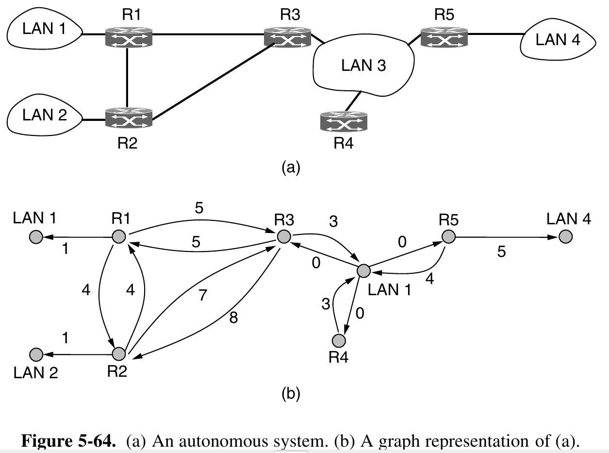
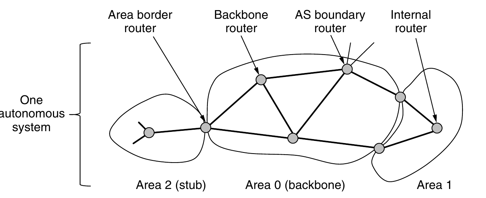
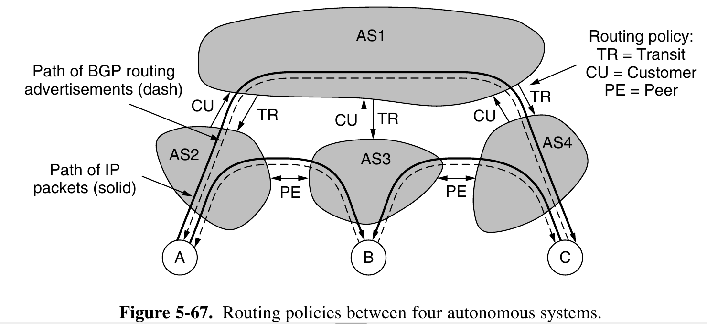
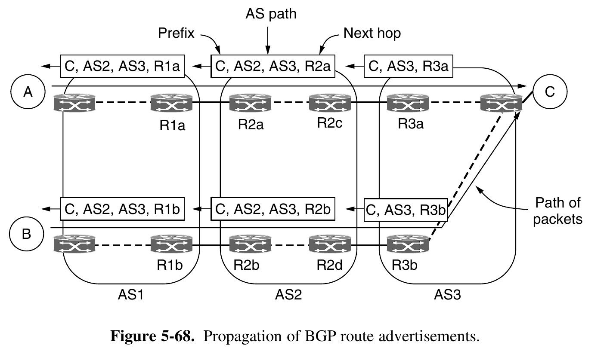
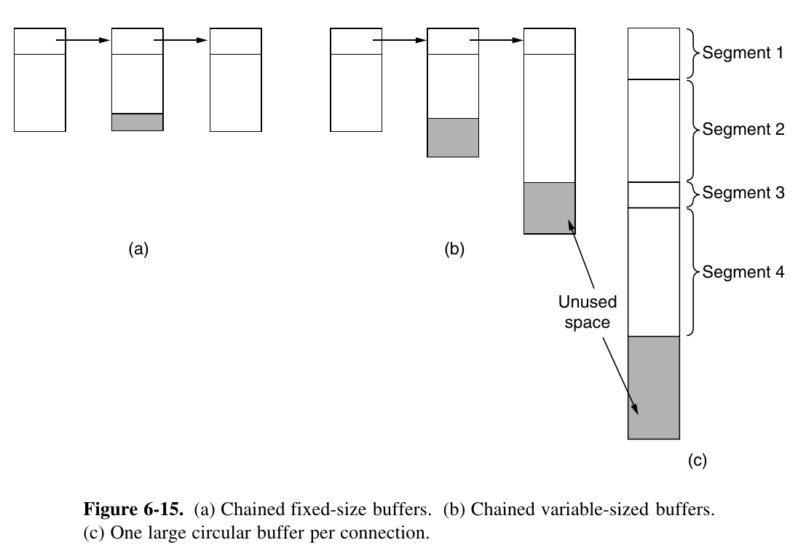
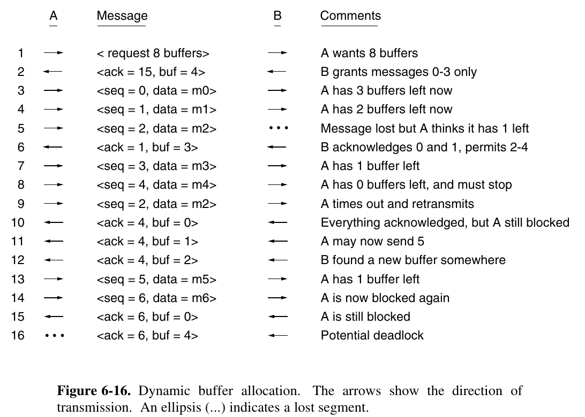
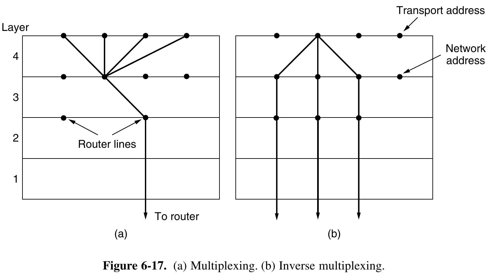
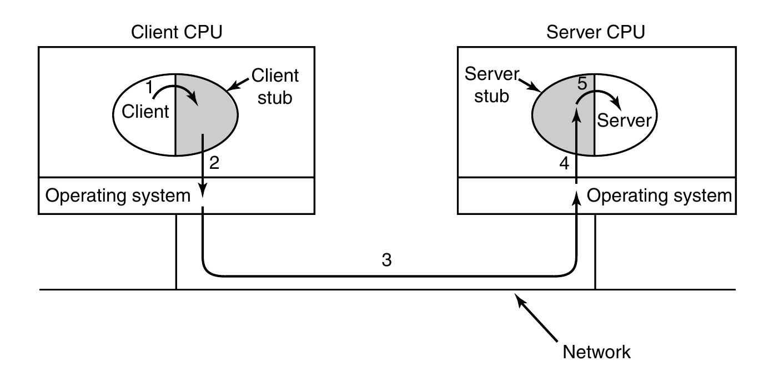

See slides from Lec 15 to 24. 

See [Lec 15](../../../assets/btech/cs/computer_networks/lec15.pdf).

See [Lec 16](../../../assets/btech/cs/computer_networks/lec16.pdf).

See [Lec 17](../../../assets/btech/cs/computer_networks/lec17.pdf).

See [Lec 18](../../../assets/btech/cs/computer_networks/lec18.pdf).

See [Lec 19](../../../assets/btech/cs/computer_networks/lec19.pdf).

See [Lec 20](../../../assets/btech/cs/computer_networks/lec20.pdf).

See [Lec 21](../../../assets/btech/cs/computer_networks/lec21.pdf).

See [Lec 22](../../../assets/btech/cs/computer_networks/lec22.pdf).

See [Lec 23](../../../assets/btech/cs/computer_networks/lec23.pdf).

See [Lec 24](../../../assets/btech/cs/computer_networks/lec24.pdf).

## OSPF - An Interior Gateway Routing Protocol

Inside of its own network (Autonomous Systems ASes = independent networks), an organization can use its own algorithm for internal routing, or **intradomain** routing. An intradomain routing protocol is also called an **interior** gateway protocol (Similarly **interdomain** routing, here all must use the same **exterior gateway protocol** protocol, viz. BGP (Border Gateway Protocol)).

### Salient Features

* Dynamic
* Supports routing based on type of service
* Does load balancing (splitting the load over multiple lines)
* Supports hierarchical systems

### Algorithm

Most of the routers in Fig. 5-64(a) are connected to other routers by point-to-point links, and to networks to reach the hosts on those networks. However, routers R3, R4, and R5 are connected by a broadcast LAN such as switched Ethernet.

A broadcast network is represented by a node for the network itself, plus a node for each router. The arcs from that network node to the routers have weight 0. They are important nonetheless, as without them there is no path through the network. Other networks, which have only hosts, have only an arc reaching them and not one returning.  This structure gives routes to hosts, but not through them.

What OSPF fundamentally does is represent the actual network as a graph like this and then use the link state method to have every router compute the shortest path from itself to all other nodes. Multiple paths may be found that are equally short. In this case, OSPF remembers the set of shortest paths and during packet forwarding, traffic is split across them. This helps to balance load. It is called ECMP (Equal Cost MultiPath).

Many of the ASes in the Internet are themselves large and nontrivial to man- age. To work at this scale, OSPF allows an AS to be divided into numbered areas, where an area is a network or a set of contiguous networks. Areas do not overlap but need not be exhaustive, that is, some routers may belong to no area. Routers that lie wholly within an area are called **internal** routers. An area is a generalization of an individual network. Outside an area, its destinations are visi- ble but not its topology. This characteristic helps routing to scale.

Every AS has a **backbone** area, called area 0. The routers in this area are called **backbone routers**. All areas are connected to the backbone, possibly by tunnels, so it is possible to go from any area in the AS to any other area in the AS via the backbone. A tunnel is represented in the graph as just another arc with a cost. As with other areas, the topology of the backbone is not visible outside the backbone.

Each router that is connected to two or more areas is called an area border router. It must also be part of the backbone. The job of an area border router is to summarize the destinations in one area and to inject this summary into the other areas to which it is connected. This summary includes cost information but not all the details of the topology within an area. Passing cost information allows hosts in other areas to find the best area border router to use to enter an area.

However, if there is only one border router out of an area, even the summary does not need to be passed. Routes to destinations out of the area always start with the instruction ‘‘Go to the border router.’’ This kind of area is called a **stub area**.

The last kind of router is the **AS boundary router**. It injects routes to external destinations on other ASes into the area. The external routes then appear as destinations that can be reached via the AS boundary router with some cost

For a source and destination in the same area, the best intra-area route (that lies wholly within the area) is chosen. For a source and destination in different areas, the inter-area route must go from the source to the backbone, across the backbone to the destination area, and then to the destination.

In particular, it is inefficient to have every router on a LAN talk to every other router on the LAN. To avoid this situation, one router is elected as the designated router. It is said to be adjacent to all the other routers on its LAN, and exchanges information with them. In effect, it is acting as the single node that represents the LAN.

During normal operation, each router periodically floods LINK STATE UPDATE messages to each of its adjacent routers. These messages gives its state and provide the costs used in the topological database. The flooding messages are acknowledged, to make them reliable. Each message has a sequence number, so a router can see whether an incoming LINK STATE UPDATE is older or newer than what it currently has.

DATABASE DESCRIPTION messages give the sequence numbers of all the link state entries currently held by the sender. By comparing its own values with those of the sender, the receiver can determine who has the most recent values.

Either partner can request link state information from the other one by using LINK STATE REQUEST messages. The result of this algorithm is that each pair of adjacent routers checks to see who has the most recent data

| Message Type         | Description                                  |
| -------------------- | -------------------------------------------- |
| Hello                | Used to discover who the neighbors are       |
| Link state update    | Provides the sender’s costs to its neighbors |
| Link state  ack      | Acknowledges link state update               |
| Database description | Announces which updates the sender has       |
| Link state request   | Requests information from the partner        |

## BGP

One common policy is that a customer ISP pays another provider ISP to deliver packets to any other destination on the Internet and receive packets sent from any other destination. The customer ISP is said to buy transit service from the provider ISP.

AS2, AS3, and AS4 are customers of AS1. They buy transit service from it. Thus, when source A sends to destination C, the packets travel from AS2 to AS1 and finally to AS4. The routing advertisements travel in the opposite direction to the packets. AS4 advertises C as a destination to its tran- sit provider, AS1, to let sources reach C via AS1. Later, AS1 advertises a route to C to its other customers, including AS2, to let the customers know that they can send traffic to C via AS1.

Suppose that AS2 and AS3 exchange a lot of traffic. Given that their networks are connected already, if they want to, they can use a different policy—they can send traffic directly to each other for free. This will reduce the amount of traffic they must have AS1 deliver on their behalf, and hopefully it will reduce their bills. This policy is called peering. Note that peering is not transitive. AS3 and AS4 also peer with each other. This peering allows traffic from C destined for B to be sent directly to AS4. What hap- pens if C sends a packet to A? AS3 is only advertising a route to B to AS4. It is not advertising a route to A.

On the other hand, some company networks are connected to multiple ISPs. This technique is used to improve reliability, since if the path through one ISP fails, the company can use the path via the other ISP. This technique is called multihoming.

Instead of maintaining just the cost of the route to each destination, each BGP router keeps track of the path used. This approach is called a path vec- tor protocol. The path consists of the next hop router (which may be on the other side of the ISP, not adjacent) and the sequence of ASes, or AS path, that the route has followed (given in reverse order).

So far we have seen how a route advertisement is sent across the link between two ISPs. We still need some way to propagate BGP routes from one side of the ISP to the other, so they can be sent on to the next ISP. This task could be handled by the intradomain protocol, but because BGP is very good at scaling to large networks, a variant of BGP is often used. It is called iBGP (internal BGP) to distinguish it from the regular use of BGP as eBGP (external BGP)

The final strategy is to prefer the route that has the lowest cost within the ISP. This is the strategy implemented in Fig. 5-68. Packets sent from A to C exit AS1 at the top router, R1a. Packets sent from B exit via the bottom router, R1b. The reason is that both A and B are taking the lowest-cost path or quickest route out of AS1. Because they are located in different parts of the ISP, the quickest exit for each one is different. The same thing happens as the packets pass through AS2. On the last leg, AS3 has to carry the packet from B through its own network. This strategy is known as early exit or hot-potato routing.

## Error control and flow control 

Given that these mechanisms are used on frames at the link layer, it is natural
to wonder why they would be used on segments at the transport layer as well. However, there is little duplication between the link and transport layers in practice. Even though the same mechanisms are used, there are differences in function and degree.

For a difference in function, consider error detection. The link layer check- sum protects a frame while it crosses a single link. The transport layer checksum protects a segment while it crosses an entire network path. It is an end-to-end check, which is not the same as having a check on every link. Saltzer et al. (1984) describe a situation in which packets were corrupted inside a router. The link layer checksums protected the packets only while they traveled across a link, not while they were inside the router. Thus, packets were delivered incorrectly even though they were correct according to the checks on every link. This and other examples led Saltzer et al. to articulate the end-to-end argument

As a difference in degree, consider retransmissions and the sliding window
protocol. Most wireless links, other than satellite links, can have only a single
frame outstanding from the sender at a time. That is, the bandwidth-delay product
for the link is small enough that not even a whole frame can be stored inside the
link. In this case, a small window size is sufficient for good performance. 
On the other hand, many TCP connections have a bandwidth-delay product
that is much larger than a single segment.  Consider a connection sending data a-
cross the U.S. at 1 Mbps with a round-trip time of 100 msec. Even for this slow
connection, 200 Kbit of data will be stored at the receiver in the time it takes to
send a segment and receive an acknowledgement. For these situations, a large
sliding window must be used. Stop-and-wait will cripple performance.

The best trade-off between source buffering and destination buffering depends
on the type of traffic carried by the connection. For low-bandwidth bursty traffic,
such as that produced by an interactive terminal, it is reasonable not to dedicate
any buffers, but rather to acquire them dynamically at both ends, relying on buff-
ering at the sender if segments must occasionally be discarded. On the other
hand, for file transfer and other high-bandwidth traffic, it is better if the receiver
does dedicate a full window of buffers, to allow the data to flow at maximum
speed. This is the strategy that TCP uses.

There still remains the question of how to organize the buffer pool. If most
segments are nearly the same size, it is natural to organize the buffers as a pool of
identically sized buffers, with one segment per buffer, as in Fig. 6-15(a). Howev-
er, if there is wide variation in segment size, from short requests for Web pages to
large packets in peer-to-peer file transfers, a pool of fixed-sized buffers presents
problems. If the buffer size is chosen to be equal to the largest possible segment,
space will be wasted whenever a short segment arrives. If the buffer size is cho-
sen to be less than the maximum segment size, multiple buffers will be needed for
long segments, with the attendant complexity.
Another approach to the buffer size problem is to use variable-sized buffers,
as in Fig. 6-15(b). The advantage here is better memory utilization, at the price of
more complicated buffer management. A third possibility is to dedicate a single
large circular buffer per connection, as in Fig. 6-15(c). This system is simple and
elegant and does not depend on segment sizes, but makes good use of memory
only when the connections are heavily loaded.

Initially, the sender requests a certain number of buffers, based on its
expected needs. The receiver then grants as many of these as it can afford. Every
time the sender transmits a segment, it must decrement its allocation, stopping
altogether when the allocation reaches zero. The receiver separately piggybacks
both acknowledgements and buffer allocations onto the reverse traffic.

Situation at line 16 can be handled like: To prevent this situation, each host should periodically send control
segments giving the acknowledgement and buffer status on each connection. That
way, the deadlock will be broken, sooner or later.

When buffer space no longer limits the maximum flow, another bottleneck
will appear: the carrying capacity of the network. If adjacent routers can ex-
change at most x packets/sec and there are k disjoint paths between a pair of hosts,
there is no way that those hosts can exchange more than kx segments/sec, no mat-
ter how much buffer space is available at each end. If the sender pushes too hard
(i.e., sends more than kx segments/sec), the network will become congested be-
cause it will be unable to deliver segments as fast as they are coming in.
Belsnes (1975) proposed using a sliding window flow-control scheme
in which the sender dynamically adjusts the window size to match the network’s
carrying capacity. This means that a dynamic sliding window can implement both
flow control and congestion control. If the network can handle c segments/sec
and the round-trip time (including transmission, propagation, queueing, proc-
essing at the receiver, and return of the acknowledgement) is r, the sender’s win-
dow should be cr. With a window of this size, the sender normally operates with
the pipeline full.

## Multiplexing 

In the transport layer, the need for multiplexing can arise in a number of ways.
For example, if only one network address is available on a host, all transport con-
nections on that machine have to use it. When a segment comes in, some way is
needed to tell which process to give it to. This situation, called multiplexing, is
shown in Fig. 6-17(a). In this figure, four distinct transport connections all use the
same network connection (e.g., IP address) to the remote host.

Multiplexing can also be useful in the transport layer for another reason. Sup-
pose, for example, that a host has multiple network paths that it can use. If a user
needs more bandwidth or more reliability than one of the network paths can pro-
vide, a way out is to have a connection that distributes the traffic among multiple
network paths on a round-robin basis, as indicated in Fig. 6-17(b). This modus
operandi is called inverse multiplexing. With k network connections open, the
effective bandwidth might be increased by a factor of k. An example of inverse
multiplexing is SCTP (Stream Control Transmission Protocol), which can run
a connection using multiple network interfaces.

## Crash Recovery 

let us assume that one host, the client, is sending a long file to another host, the file server, using a simple stop-and-wait protocol. The transport layer on the server just passes the incoming segments to the transport user, one by one. Partway through the transmission, the server crashes. When it comes back up, its tables are reinitialized, so it no longer knows precisely where it was. In an attempt to recover its previous status, the server might send a broadcast segment to all other hosts, announcing that it has just crashed and requesting that its clients inform it of the status of all open connections. Each client can be in one of two states: one segment outstanding, S1, or no segments outstanding, S0. Based on only this state information, the client must decide whether to retransmit the most recent segment. At first glance, it would seem obvious: the client should retransmit if and only if it has an unacknowledged segment outstanding (i.e., is in state S1) when it learns of the crash. However, a closer inspection reveals difficulties with this naive approach. Consider, for example, the situation in which the server’s transport entity first sends an acknowledgement and then, when the acknowledgement has been sent, writes to the application process. Writing a segment onto the output stream and sending an acknowledgement are two distinct events that cannot be done simultaneously. If a crash occurs after the acknowledgement has been sent but before the write has been fully completed, the client will receive the acknowledgement and thus be in state S0 when the crash recovery announcement arrives. The client will therefore not retransmit, (incorrectly) thinking that the segment has arrived. This decision by the client leads to a missing segment.

At this point you may be thinking: ‘‘That problem can be solved easily. All you have to do is reprogram the transport entity to first do the write and then send the acknowledgement.’’ Try again. Imagine that the write has been done but the crash occurs before the acknowledgement can be sent. The client will be in state S1 and thus retransmit, leading to an undetected duplicate segment in the output stream to the server application process. No matter how the client and server are programmed, there are always situations where the protocol fails to recover properly.

Put in more general terms, this result can be restated as ‘‘recovery from a layer N crash can only be done by layer N + 1,’’ and then only if the higher layer retains enough status information to reconstruct where it was before the problem occurred. This is consistent with the case mentioned above that the transport layer can recover from failures in the network layer, provided that each end of a connection keeps track of where it is.

## Remote Procedure Calls

When a process on machine 1 calls a procedure on machine 2, the calling process on 1 is suspended and execution of the called procedure takes place on 2. Information can be transported from the caller to the callee in the parameters and can come back in the procedure result. No message passing is visible to the application programmer. This technique is known as RPC (Remote Procedure Call) and has become the basis for many networking applications. Traditionally, the calling procedure is known as the client and the called procedure is known as the server

In the simplest form, to call a remote procedure, the client program must be bound with a small library procedure, called the client stub, that represents the server procedure in the client’s address space. Similarly, the server is bound with a procedure called the server stub. These procedures hide the fact that the procedure call from the client to the server is not local.

The actual steps in making an RPC are shown in Fig. 6-29. Step 1 is the client calling the client stub. This call is a local procedure call, with the parameters pushed onto the stack in the normal way. Step 2 is the client stub packing the parameters into a message and making a system call to send the message. Packing the parameters is called marshaling. Step 3 is the operating system sending the message from the client machine to the server machine. Step 4 is the operating system passing the incoming packet to the server stub. Finally, step 5 is the server stub calling the server procedure with the unmarshaled parameters. The reply traces the same path in the other direction.

**Problems** 

* Pointers cannot be copy because they lie in different address space. 
* Arrays cant be marshalled because their size is unknown. 
* Arguments type and number can be any.
* Global variables.
* Operation may not be idempotent (i.e., safe to repeat). (In case packet is to be resent)

## DTN 

In DTN terminology, a message is called a bundle. DTN nodes are equipped
with storage, typically persistent storage such as a disk or flash memory.  
They
store bundles until links become available and then forward the bundles. The links
work intermittently. Fig. 6-56 shows five intermittent links that are not currently
working, and two links that are working. A working link is called a contact.
Fig. 6-56 also shows bundles stored at two DTN nodes awaiting contacts to send
the bundles onward. In this way, the bundles are relayed via contacts from the
source to their destination.
Note that while these bundles are stored, nodes can as well move.

### Bundle Protocol

Bundle protocol runs above the level of TCP/IP. Since the Bundle protocol is fixed, yet it is intended to run over a variety of
transports, there is must be a gap in functionality between the protocols. That gap
is the reason for the inclusion of a convergence layer.

Bundle = primary block (Header) + payload block (Data)

DTNs deal with this problem using the
notion of custody transfer, in which another node, closer to the destination, can
assume responsibility for seeing the data safely delivered.