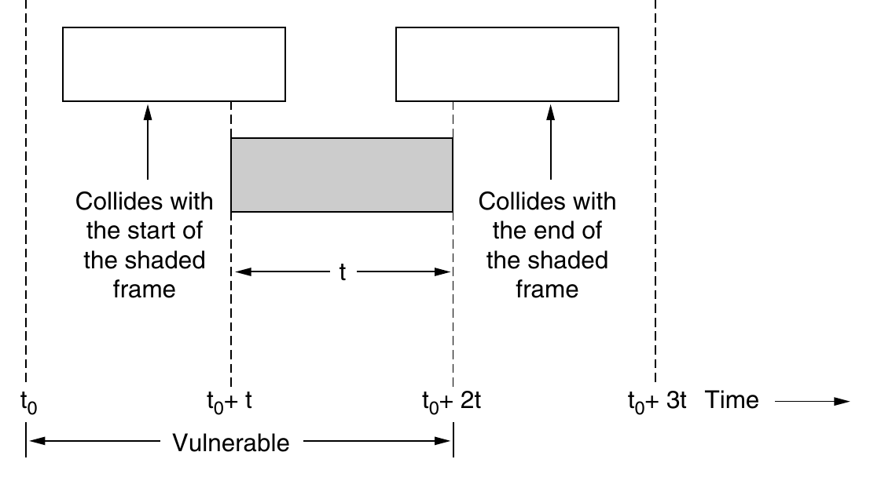
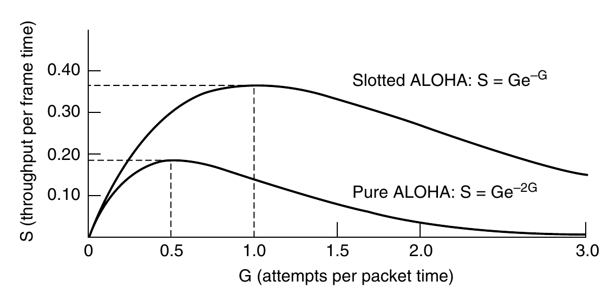
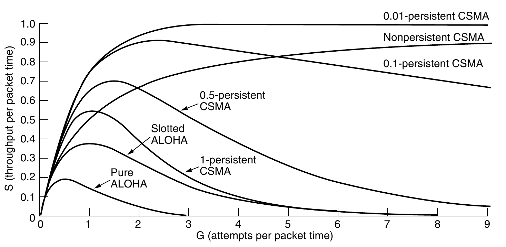
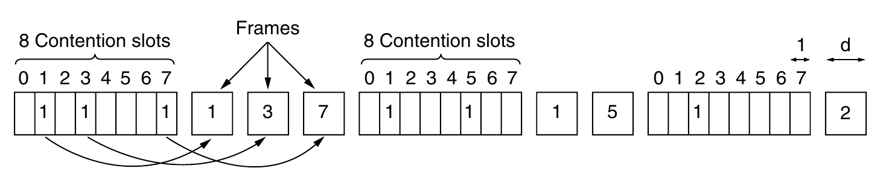
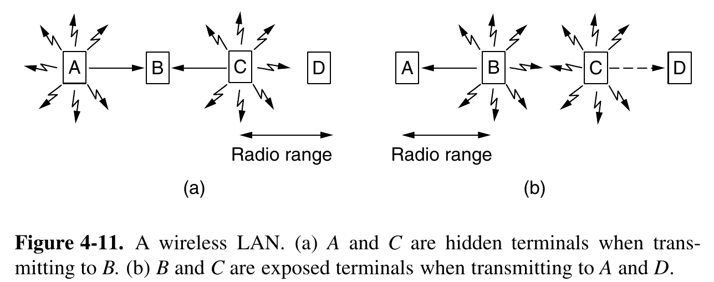
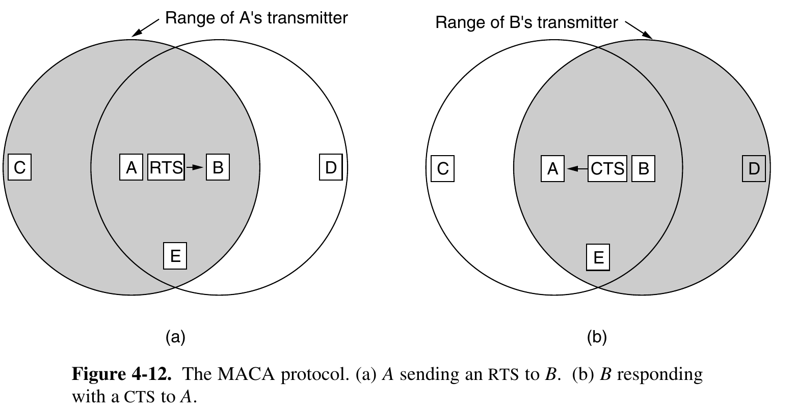

Network links can be divided into two categories: those using point-to-point
connections and those using broadcast channels. We studied point-to-point links
in Physical Layer chapter; this chapter deals with broadcast links and their protocols.

In the literature, broadcast channels are sometimes referred to as multiaccess
channels or random access channels.

The protocols used to determine who goes next on a multiaccess channel belong to a sublayer of the data link layer called the MAC (Medium Access Control) sublayer.

## Static Channel Allocation

The traditional way of allocating a single channel, such as a telephone trunk,
among multiple competing users is to chop up its capacity by using one of the
multiplexing schemes we described previously, such as FDM (Frequency Division
Multiplexing). If there are N users, the bandwidth is divided into N equal-sized
portions, with each user being assigned one portion. Since each user has a private
frequency band, there is now no interference among users. When there is only a
small and constant number of users, each of which has a steady stream or a heavy
load of traffic, this division is a simple and efficient allocation mechanism. A
wireless example is FM radio stations. Each station gets a portion of the FM band
and uses it most of the time to broadcast its signal.

However,when the number of senders is large and varying or the traffic is
bursty, FDM presents some problems. If the spectrum is cut up into N regions and
fewer than N users are currently interested in communicating, a large piece of
valuable spectrum will be wasted. And if more than N users want to communicate, some of them will be denied permission for lack of bandwidth, even if some
of the users who have been assigned a frequency band hardly ever transmit or receive anything.

The poor performance of static FDM can easily be seen with a simple queueing theory calculation. Let us start by finding the mean time delay, T, to send a
frame onto a channel of capacity C bps. We assume that the frames arrive randomly with an average arrival rate of λ frames/sec, and that the frames vary in
length with an average length of 1/μ bits.

With these parameters, the arrival rate of the channel is λ/μ bps. Then,
the system utilization is given by ρ = arrival rate/service rate = λ/μC .
A standard queueing theory result is

$T = \frac{1/service\\_rate}{1 - \rho}$

Now let us divide the single channel into N independent subchannels, each
with capacity C /N bps. The mean input rate on each of the subchannels will now
be λ/N. Recomputing T, we get

$T_N = NT$.

The mean delay for the divided channel is N times worse than if all the frames
were somehow magically arranged orderly in a big central queue. This same result
says that a bank lobby full of ATM machines is better off having a single queue
feeding all the machines than a separate queue in front of each machine.

Precisely the same arguments that apply to FDM also apply to other ways of
statically dividing the channel. If we were to use time division multiplexing
(TDM) and allocate each user every Nth time slot, if a user does not use the allocated slot, it would just lie fallow.

Since none of the traditional static channel allocation methods work well at all
with bursty traffic, we will now explore dynamic methods.

## Assumptions for Dynamic Channel Allocation

Independent Traffic. The model consists of N independent stations
(e.g., computers, telephones), each with a program or user that generates frames for transmission. The expected number of frames generated in an interval of length Δt is λΔt, where λ is a constant (the arrival rate of new frames). Once a frame has been generated, the station is blocked and does nothing until the frame has been successfully transmitted.

Single Channel. A single channel is available for all communication. All stations can transmit on it and all can receive from it. The
stations are assumed to be equally capable, though protocols may
assign them different roles (e.g., priorities).

Observable Collisions. If two frames are transmitted simultaneously, they overlap in time and the resulting signal is garbled. This
event is called a collision. All stations can detect that a collision has
occurred. A collided frame must be transmitted again later. No errors other than those generated by collisions occur. (collisions are usually
inferred after the fact by the lack of an expected acknowledgement frame)

Continuous or Slotted Time. Time may be assumed continuous, in
which case frame transmission can begin at any instant. Alternatively, time may be slotted or divided into discrete intervals (called
slots). Frame transmissions must then begin at the start of a slot. A
slot may contain 0, 1, or more frames, corresponding to an idle slot, a
successful transmission, or a collision, respectively.

Carrier Sense or No Carrier Sense. With the carrier sense assumption, stations can tell if the channel is in use before trying to use
it. No station will attempt to use the channel while it is sensed as
busy. If there is no carrier sense, stations cannot sense the channel
before trying to use it. They just go ahead and transmit. Only later
can they determine whether the transmission was successful.

## Pure Aloha

The basic idea of an ALOHA system is simple: let users transmit whenever
they have data to be sent. There will be collisions, of course, and the colliding
frames will be damaged. Senders need some way to find out if this is the case. In
the ALOHA system, after each station has sent its frame to the central computer,
this computer rebroadcasts the frame to all of the stations. A sending station can
thus listen for the broadcast from the hub to see if its frame has gotten through. In
other systems, such as wired LANs, the sender might be able to listen for collisions while transmitting.
If the frame was destroyed, the sender just waits a random amount of time and
sends it again. The waiting time must be random or the same frames will collide
over and over, in lockstep. Systems in which multiple users share a common
channel in a way that can lead to conflicts are known as contention systems.

**Analysis:**

Let the ‘‘frame time’’ denote the amount of time needed to transmit the standard, fixed-length frame (i.e., the frame length divided by the bit rate). At this
point, we assume that the new frames generated by the stations are well modeled
by a Poisson distribution with a mean of N frames per frame time. (The infinitepopulation assumption is needed to ensure that N does not decrease as users become blocked.) If N > 1, the user community is generating frames at a higher
rate than the channel can handle, and nearly every frame will suffer a collision.
For reasonable throughput, we would expect 0 < N < 1.

In addition to the new frames, the stations also generate retransmissions of
frames that previously suffered collisions. Let us further assume that the old and
new frames combined are well modeled by a Poisson distribution, with mean of G
frames per frame time. Clearly, G ≥ N. At low load (i.e., N ∼
 ∼ 0), there will be
few collisions, hence few retransmissions, so G ∼
 ∼ N. At high load, there will be
many collisions, so G > N. Under all loads, the throughput, S, is just the offered
load, G, times the probability, $P_0$ , of a transmission succeeding—that is,
$S = GP_0$ , where $P_0$ is the probability that a frame does not suffer a collision.

Let $t$ be the time required to send one frame

The probability that $k$ frames are generated during a given frame time, in
which $G$ frames are expected, is given by the Poisson distribution

$Pr[k] = \frac{G^ke^{-G}}{k!}$

so the probability of zero frames is just $e^{-G}$. In an interval two frame times long,
the mean number of frames generated is $2G$. The probability of no frames being
initiated during the entire vulnerable period is thus given by $P_0 = e^{−2G}$ . Using
$S = GP_0$ , we get $S = Ge^{−2G}$. 

## Slotted Aloha

One way to achieve synchronization would be to have one special station emit a pip at the start of each interval, like a clock.

The probability of no other traffic during the same slot as our test frame is then $e^{-G}$ , which leads to $S = Ge^{−G}$ 

Operating at higher values of G reduces the number of empties
but increases the number of collisions exponentially. To see how this rapid
growth of collisions with G comes about, consider the transmission of a test
frame. The probability that it will avoid a collision is $e^{-G}$ , which is the probability that all the other stations are silent in that slot. The probability of a collision is
then just $1 − e^{−G}$ . The probability of a transmission requiring exactly k attempts
(i.e., k − 1 collisions followed by one success) is

$P_k = e^{-G}(1 - e^{-G})^{k - 1}$

The expected number of transmissions, E, per line typed at a terminal is then

$E = \sum_{k = 1}^{\inf}kP_k = \sum_{k = 1}^{\inf}ke^{-G}(1 - e^{-G})^{k - 1} = e^G.$

As a result of the exponential dependence of E upon G, small increases in the
channel load can drastically reduce its performance.

## 1 persistent CSMA

* CSMA = Carrier Sense Multiple Access.
*  When a station has data to send, it first listens to the chan-
nel to see if anyone else is transmitting at that moment. If the channel is idle, the
stations sends its data. Otherwise, if the channel is busy, the station just waits
until it becomes idle. Then the station transmits a frame. If a collision occurs, the
station waits a random amount of time and starts all over again. The protocol is
called 1-persistent because the station transmits with a probability of 1 when it
finds the channel idle.

More subtly, the propagation delay has an important effect on collisions.
There is a chance that just after a station begins sending, another station will be-
come ready to send and sense the channel. If the first station’s signal has not yet
reached the second one, the latter will sense an idle channel and will also begin
sending, resulting in a collision. This chance depends on the number of frames
that fit on the channel, or the bandwidth-delay product of the channel. If only a
tiny fraction of a frame fits on the channel, which is the case in most LANs since
the propagation delay is small, the chance of a collision happening is small. The
larger the bandwidth-delay product, the more important this effect becomes, and
the worse the performance of the protocol.

## Non persistent CSMA

In this protocol, a
conscious attempt is made to be less greedy than in the previous one. As before, a
station senses the channel when it wants to send a frame, and if no one else is
sending, the station begins doing so itself. However, if the channel is already in
use, the station does not continually sense it for the purpose of seizing it im-
mediately upon detecting the end of the previous transmission. Instead, it waits a
random period of time and then repeats the algorithm. Consequently, this algo-
rithm leads to better channel utilization but longer delays than 1-persistent
CSMA.

## p persistent CSMA

It applies to slotted channels and
works as follows. When a station becomes ready to send, it senses the channel. If
it is idle, it transmits with a probability p. With a probability q = 1 − p, it defers
until the next slot. If that slot is also idle, it either transmits or defers again, with
probabilities p and q. This process is repeated until either the frame has been
transmitted or another station has begun transmitting. In the latter case, the
unlucky station acts as if there had been a collision (i.e., it waits a random time
and starts again). If the station initially senses that the channel is busy, it waits
until the next slot and applies the above algorithm.

## CSMA with Collision Detection (CSMA/CD)

Another improvement
is for the stations to quickly detect the collision and abruptly stop transmitting,
(rather than finishing them) since they are irretrievably garbled anyway. This
strategy saves time and bandwidth.

It is important to realize that collision detection is an analog proc-
ess. The station’s hardware must listen to the channel while it is transmitting. If
the signal it reads back is different from the signal it is putting out, it knows that a
collision is occurring. The implications are that a received signal must not be tiny
compared to the transmitted signal (which is difficult for wireless, as received sig-
nals may be 1,000,000 times weaker than transmitted signals) and that the modu-
lation must be chosen to allow collisions to be detected (e.g., a collision of two 0-
volt signals may well be impossible to detect).

At the point marked $t_0$ , a station has finished transmitting its frame.
Any other station having a frame to send may now attempt to do so. If two or
more stations decide to transmit simultaneously, there will be a collision. If a sta-
tion detects a collision, it aborts its transmission, waits a random period of time,
and then tries again (assuming that no other station has started transmitting in the
meantime). Therefore, our model for CSMA/CD will consist of alternating con-
tention and transmission periods, with idle periods occurring when all stations are
quiet (e.g., for lack of work).

Now let us look at the details of the contention algorithm. Suppose that two
stations both begin transmitting at exactly time $t_0$ . How long will it take them to
realize that they have collided? The answer is vital to determining the length of
the contention period and hence what the delay and throughput will be.
The minimum time to detect the collision is just the time it takes the signal to
propagate from one station to the other. Based on this information, you might
think that a station that has not heard a collision for a time equal to the full cable
propagation time after starting its transmission can be sure it has seized the cable.
By ‘‘seized,’’ we mean that all other stations know it is transmitting and will not
interfere. This conclusion is wrong.
Consider the following worst-case scenario. Let the time for a signal to pro-
pagate between the two farthest stations be τ. At $t_0$ , one station begins trans-
mitting. At $t_0$ + τ − ε, an instant before the signal arrives at the most distant sta-
tion, that station also begins transmitting. Of course, it detects the collision al-
most instantly and stops, but the little noise burst caused by the collision does not
get back to the original station until time 2τ − ε. In other words, in the worst case
a station cannot be sure that it has seized the channel until it has transmitted for 2τ
without hearing a collision.

## Collision free protocols

Although collisions do not occur with CSMA/CD once a station has unambi-
guously captured the channel, they can still occur during the contention period.
These collisions adversely affect the system performance, especially when the
bandwidth-delay product is large, such as when the cable is long (i.e., large τ) and
the frames are short. 

In the protocols to be described, we assume that there are exactly N stations,
each programmed with a unique address from 0 to N − 1. It does not matter that
some stations may be inactive part of the time. We also assume that propagation
delay is negligible. We continue using the model of previous figure with its
discrete contention slots.

### Bit Map Protocol

In our first collision-free protocol, the basic bit-map method, each con-
tention period consists of exactly N slots. If station 0 has a frame to send, it trans-
mits a 1 bit during the slot 0. No other station is allowed to transmit during this
slot. Regardless of what station 0 does, station 1 gets the opportunity to transmit a
1 bit during slot 1, but only if it has a frame queued. In general, station j may
announce that it has a frame to send by inserting a 1 bit into slot j. After all N
slots have passed by, each station has complete knowledge of which stations wish
to transmit. At that point, they begin transmitting frames in numerical order.

Protocols like this in which the desire to transmit is broadcast before the ac-
tual transmission are called reservation protocols because they reserve channel
ownership in advance and prevent collisions.

**Analysis:**

Under conditions of low load, the bit map will simply be repeated over and
over, for lack of data frames. Consider the situation from the point of view of a
low-numbered station, such as 0 or 1. Typically, when it becomes ready to send,
the ‘‘current’’ slot will be somewhere in the middle of the bit map. On average,
the station will have to wait N /2 slots for the current scan to finish and another
full N slots for the following scan to run to completion before it may begin trans-
mitting.
The prospects for high-numbered stations are brighter. Generally, these will
only have to wait half a scan (N /2 bit slots) before starting to transmit. High-
numbered stations rarely have to wait for the next scan. Since low-numbered sta-
tions must wait on average 1.5N slots and high-numbered stations must wait on
average 0.5N slots, the mean for all stations is N slots.
The channel efficiency at low load is easy to compute. The overhead per
frame is N bits and the amount of data is d bits, for an efficiency of d /(d + N).
At high load, when all the stations have something to send all the time, the N-
bit contention period is prorated over N frames, yielding an overhead of only 1 bit
per frame, or an efficiency of d /(d + 1). The mean delay for a frame is equal to
the sum of the time it queues inside its station, plus an additional (N − 1)d + N
once it gets to the head of its internal queue. This interval is how long it takes to
wait for all other stations to have their turn sending a frame and another bitmap.

### Token Passing

The token represents permission to send. If a station has a
frame queued for transmission when it receives the token, it can send that frame
before it passes the token to the next station. If it has no queued frame, it simply
passes the token.

In a token ring protocol, the topology of the network is used to define the
order in which stations send. Frames are also transmitted in the direction of the token. This way they
will circulate around the ring and reach whichever station is the destination. How-
ever, to stop the frame circulating indefinitely (like the token), some station needs
to remove it from the ring. This station may be either the one that originally sent
the frame, after it has gone through a complete cycle, or the station that was the
intended recipient of the frame.

Note that we do not need a physical ring to implement token passing. The
channel connecting the stations might instead be a single long bus. Each station
then uses the bus to send the token to the next station in the predefined sequence.
Possession of the token allows a station to use the bus to send one frame, as be-
fore. This protocol is called token bus.

The performance of token passing is similar to that of the bit-map protocol,
though the contention slots and frames of one cycle are now intermingled. After
sending a frame, each station must wait for all N stations (including itself) to send
the token to their neighbors and the other N − 1 stations to send a frame, if they
have one. A subtle difference is that, since all positions in the cycle are equiva-
lent, there is no bias for low- or high-numbered stations

### Binary Countdown

A problem with the basic bit-map protocol, and by extension token passing, is
that the overhead is 1 bit per station, so it does not scale well to networks with
thousands of stations. We can do better than that by using binary station ad-
dresses with a channel that combines transmissions. A station wanting to use the
channel now broadcasts its address as a binary bit string, starting with the high-
order bit. All addresses are assumed to be the same length. The bits in each ad-
dress position from different stations are BOOLEAN ORed together by the chan-
nel when they are sent at the same time.

Arbitration: the use of an arbitrator (an independent person or body officially appointed to settle a dispute.) to settle a dispute.

To avoid conflicts, an arbitration rule must be applied: as soon as a station
sees that a high-order bit position that is 0 in its address has been overwritten with
a 1, it gives up. For example, if stations 0010, 0100, 1001, and 1010 are all trying
to get the channel, in the first bit time the stations transmit 0, 0, 1, and 1, re-
spectively. These are ORed together to form a 1. Stations 0010 and 0100 see the
1 and know that a higher-numbered station is competing for the channel, so they
give up for the current round. Stations 1001 and 1010 continue.
The next bit is 0, and both stations continue. The next bit is 1, so station 1001
gives up. The winner is station 1010 because it has the highest address. After
winning the bidding, it may now transmit a frame, after which another bidding
cycle starts. 

The channel efficiency of this method is d /(d + log2 N). If, however, the
frame format has been cleverly chosen so that the sender’s address is the first field
in the frame, even these log2 N bits are not wasted, and the efficiency is 100%.

## Wireless LAN protocols

Wireless LAN — a set of nodes sending messages to each other via a
wireless medium.

A station on a wireless LAN may not be able to transmit frames to or
receive frames from all other stations because of the limited radio
range of the stations..

Detection of collision is difficult and often impossible.
Acknowledgments are used to discover collisions and other errors.

We will assume that each radio transmitter has some fixed range,
represented by a circular coverage region within which another station
can sense and receive the station’s transmission.

First consider what happens when A and C transmit to B, as depicted in
Fig. 4-11(a). If A sends and then C immediately senses the medium, it will not
hear A because A is out of range. Thus C will falsely conclude that it can transmit
to B. If C does start transmitting, it will interfere at B, wiping out the frame from
A.

The problem of a station not being able to detect a potential
competitor for the medium because the competitor is too far away is called the
hidden terminal problem.

Now let us look at a different situation: B transmitting to A at the same time
that C wants to transmit to D, as shown in Fig. 4-11(b). If C senses the medium, it
will hear a transmission and falsely conclude that it may not send to D (shown as
a dashed line). In fact, such a transmission would cause bad reception only in the
zone between B and C, where neither of the intended receivers is located. We
want a MAC protocol that prevents this kind of deferral from happening because
it wastes bandwidth. The problem is called the exposed terminal problem.

### MACA

An early and influential protocol that tackles these problems for wireless
LANs is MACA (Multiple Access with Collision Avoidance) (Karn, 1990). The
basic idea behind it is for the sender to stimulate the receiver into outputting a
short frame, so stations nearby can detect this transmission and avoid transmitting
for the duration of the upcoming (large) data frame. This technique is used instead
of carrier sense.
MACA is illustrated in Fig. 4-12. Let us see how A sends a frame to B. A
starts by sending an RTS (Request To Send) frame to B, as shown in Fig. 4-12(a).
This short frame (30 bytes) contains the length of the data frame that will eventu-
ally follow. Then B replies with a CTS (Clear To Send) frame, as shown in
Fig. 4-12(b). The CTS frame contains the data length (copied from the RTS
frame). Upon receipt of the CTS frame, A begins transmission.

Now let us see how stations overhearing either of these frames react. Any
station hearing the RTS is clearly close to A and must remain silent long enough
for the CTS to be transmitted back to A without conflict. Any station hearing the
CTS is clearly close to B and must remain silent during the upcoming data trans-
mission, whose length it can tell by examining the CTS frame.
In Fig. 4-12, C is within range of A but not within range of B. Therefore, it
hears the RTS from A but not the CTS from B. As long as it does not interfere with
the CTS, it is free to transmit while the data frame is being sent. In contrast, D is
within range of B but not A. It does not hear the RTS but does hear the CTS.
Hearing the CTS tips it off that it is close to a station that is about to receive a
frame, so it defers sending anything until that frame is expected to be finished.
Station E hears both control messages and, like D, must be silent until the data
frame is complete.
