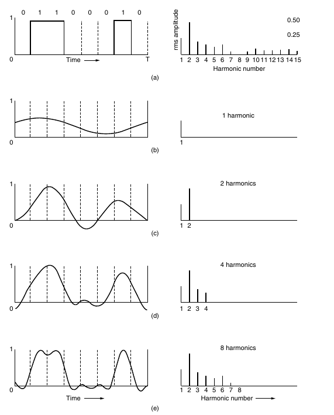
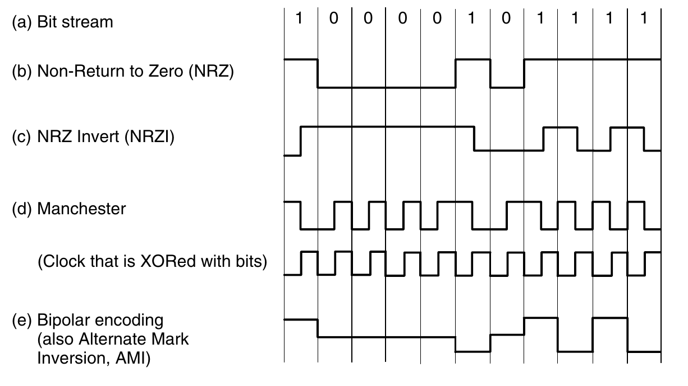
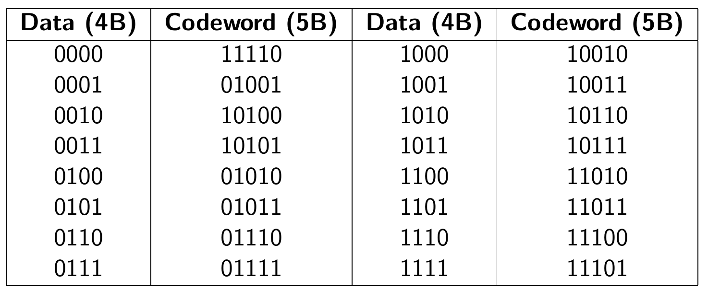
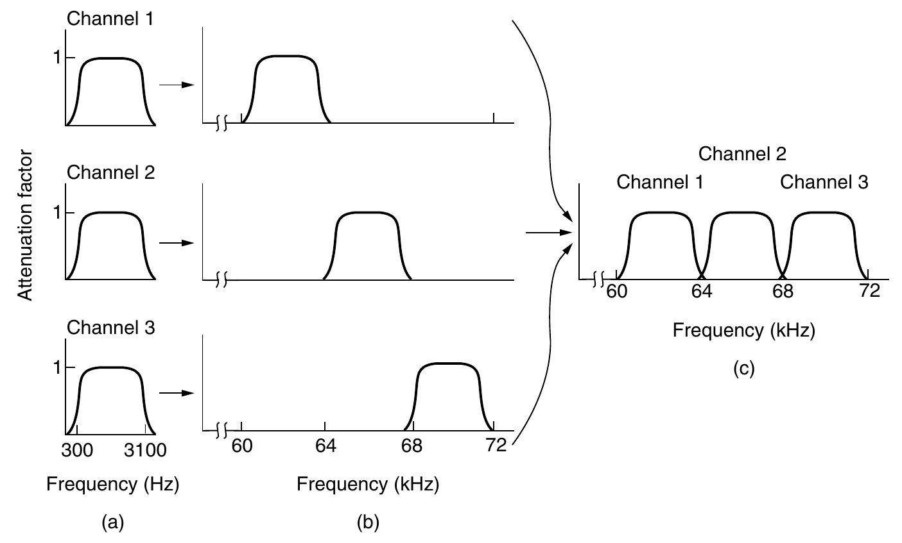
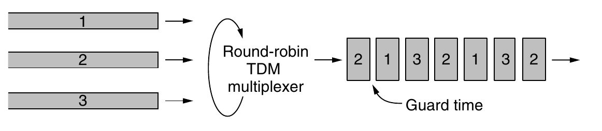

## Fourier Analysis

Fourier proved that any reasonably behaved periodic function, $g(t)$ with period $T,$ can be constructed as the sum of a (possibly infinite) number of sines and cosines:

$$
g(t)=\frac{1}{2} c+\sum_{n=1}^{\infty} a_{n} \sin (2 \pi n f t)+\sum_{n=1}^{\infty} b_{n} \cos (2 \pi n f t)
$$

where $f=1 / T$ is the fundamental frequency, $a_{n}$ and $b_{n}$ are the sine and cosine amplitudes of the $n$ th harmonics (terms), and $c$ is a constant. 

The $a_{n}$ amplitudes can be computed for any given $g(t)$ by multiplying both
sides of Eq. by $\sin (2 \pi k f t)$ and then integrating from 0 to $T .$ since

$\int_{0}^{T} \sin (2 \pi k f t) \sin (2 \pi n f t) d t=\left\\{\begin{array}{l}{0 \text { for } k \neq n} \\\ {T / 2 \text { for } k=n}\end{array}\right.$

only one term of the summation survives: $a_{n} .$ The $b_{n}$ summation vanishes completely. Similarly, by multiplying Eq. by $\cos (2 \pi k f t)$ and integrating between 0 and $T,$ we can derive $b_{n} .$ By just integrating both sides of the equation as it
stands, we can find $c .$ The results of performing these operations are as follows:

$a_{n}=\frac{2}{T} \int_{0}^{T} g(t) \sin (2 \pi n f t) d t \quad b_{n}=\frac{2}{T} \int_{0}^{T} g(t) \cos (2 \pi n f t) d t \quad c=\frac{2}{T} \int_{0}^{T} g(t) d t$

## Bandwidth-Limited Signals

The relevance of all of this to data communication is that real channels affect different frequency signals differently. Let us consider a specific example: the transmission of the ASCII character "b" encoded in an 8-bit byte. The bit pattern
that is to be transmitted is 01100010. The left-hand part of Fig. (a) shows the voltage output by the transmitting computer. The Fourier analysis of this signal
yields the coefficients:

$\begin{aligned} a_{n} &=\frac{1}{\pi n}[\cos (\pi n / 4)-\cos (3 \pi n / 4)+\cos (6 \pi n / 4)-\cos (7 \pi n / 4)] \\\ b_{n} &=\frac{1}{\pi n}[\sin (3 \pi n / 4)-\sin (\pi n / 4)+\sin (7 \pi n / 4)-\sin (6 \pi n / 4)] \\\ c &=3 / 4 \end{aligned}$

The root-mean-square amplitudes, $\sqrt{a_n^2 + b_n^2}$, for the first few terms are shown on the right-hand side of Fig. 2-1(a). These values are of interest because their squares are proportional to the energy transmitted at the corresponding frequency. No transmission facility can transmit signals without losing some power in the process. If all the Fourier components were equally diminished, the resulting signal would be reduced in amplitude but not distorted [i.e., it would have the same nice squared-off shape as Fig. 2-1(a)]. Unfortunately, all transmission facilities diminish different Fourier components by different amounts, thus introducing distortion. Usually, for a wire, the amplitudes are transmitted mostly undiminished from 0 up to some frequency $f_c$ [measured in cycles/sec or Hertz (Hz)], with all frequencies above this cutoff frequency attenuated. The width of the frequency range transmitted without being strongly attenuated is called the bandwidth. In practice, the cutoff is not really sharp, so often the quoted bandwidth is from 0 to the frequency at which the received power has fallen by half.

The bandwidth is a physical property of the transmission medium that depends on, for example, the construction, thickness, and length of a wire or fiber. Filters are often used to further limit the bandwidth of a signal. 802.11 wireless channels are allowed to use up to roughly 20 MHz, for example, so 802.11 radios filter the signal bandwidth to this size. As another example, traditional (analog) television channels occupy 6 MHz each, on a wire or over the air. This filtering lets more signals share a given region of spectrum, which improves the overall efficiency of the system. It means that the frequency range for some signals will not start at zero, but this does not matter. The bandwidth is still the width of the band of frequencies that are passed, and the information that can be carried de- pends only on this width and not on the starting and ending frequencies. Signals that run from 0 up to a maximum frequency are called baseband signals. Signals that are shifted to occupy a higher range of frequencies, as is the case for all wireless transmissions, are called passband signals. So bandwidth = baseband + passband.

*Figure 2-1. [Tanenbaum] (a) A binary signal and its root-mean-square Fourier amplitudes.
(b)–(e) Successive approximations to the original signal.*

Now let us consider how the signal of Fig. 2-1(a) would look if the bandwidth
were so low that only the lowest frequencies were transmitted [i.e., if the function
were being approximated by the first few terms of Eq. (2-1)]. Figure 2-1(b)
shows the signal that results from a channel that allows only the first harmonic
(the fundamental, $f$) to pass through. Similarly, Fig. 2-1(c)–(e) show the spectra
and reconstructed functions for higher-bandwidth channels. For digital transmission, the goal is to receive a signal with just enough fidelity to reconstruct the sequence of bits that was sent. We can already do this easily in Fig. 2-1(e), so it is
wasteful to use more harmonics to receive a more accurate replica.

Given a bit rate of b bits/sec, the time required to send the 8 bits in our example 1 bit at a time is 8/b sec, so the frequency of the first harmonic of this signal is b /8 Hz. An ordinary telephone line, often called a voice-grade line, has an
artificially introduced cutoff frequency just above 3000 Hz. The presence of this
restriction means that the number of the highest harmonic passed through is
roughly 3000/(b/8), or 24,000/b (the cutoff is not sharp).
For some data rates, the numbers work out as shown in Fig. 2-2. From these
numbers, it is clear that trying to send at 9600 bps over a voice-grade telephone
line will transform Fig. 2-1(a) into something looking like Fig. 2-1(c), making
accurate reception of the original binary bit stream tricky. It should be obvious
that at data rates much higher than 38.4 kbps, there is no hope at all for binary signals, even if the transmission facility is completely noiseless. In other words, limiting the bandwidth limits the data rate, even for perfect channels. However, coding schemes that make use of several voltage levels do exist and can achieve higher data rates. We will discuss these later in this chapter.

| Bps (b) | T (msec) (8/b) | First Harmonic (Hz) (b/8) | # Harmonics sent |
| ------- | -------------- | ------------------------- | ---------------- |
| 300     | 26.67          | 37.5                      | 80               |
| 600     | 13.33          | 75                        | 40               |
| 1200    | 6.67           | 150                       | 20               |
| 2400    | 3.33           | 300                       | 10               |
| 4800    | 1.67           | 600                       | 5                |
| 9600    | 0.83           | 1200                      | 2                |
| 19200   | 0.42           | 2400                      | 1                |
| 38400   | 0.21           | 4800                      | 0                |
*Figure 2-2. Relation between data rate and harmonics for our example.*

## The Maximum Data Rate of a Channel

Nyquist proved that if an arbitrary signal has been run through a low-pass filter of bandwidth B, the filtered signal can be completely reconstructed by making
only 2B (exact) samples per second. Sampling the line faster than 2B times per
second is pointless because the higher-frequency components that such sampling
could recover have already been filtered out. If the signal consists of V discrete
levels, Nyquist’s theorem states:
maximum data rate = $2B log_2 V$ bits/sec
 (2-2)
For example, a noiseless 3-kHz channel cannot transmit binary (i.e., two-level)
signals at a rate exceeding 6000 bps.
So far we have considered only noiseless channels. If random noise is present, the situation deteriorates rapidly. And there is always random (thermal) noise
present due to the motion of the molecules in the system. The amount of thermal
noise present is measured by the ratio of the signal power to the noise power, called the SNR (Signal-to-Noise Ratio). If we denote the signal power by S and the
noise power by N, the signal-to-noise ratio is S/N. Usually, the ratio is expressed
on a log scale as the quantity $10 \operatorname{log_{10}} S/N$ because it can vary over a tremendous
range. The units of this log scale are called decibels (dB), with ‘‘deci’’ meaning
10 and ‘‘bel’’ chosen to honor Alexander Graham Bell, who invented the telephone. An S /N ratio of 10 is 10 dB, a ratio of 100 is 20 dB, a ratio of 1000 is 30
dB, and so on. The manufacturers of stereo amplifiers often characterize the
bandwidth (frequency range) over which their products are linear by giving the 3dB frequency on each end. These are the points at which the amplification factor
has been approximately halved (because $10 \operatorname{log_{10}} 0.5 \approx -3$).
Shannon’s major result is that the maximum data rate or capacity of a noisy
channel whose bandwidth is B Hz and whose signal-to-noise ratio is S/N, is given
by:
maximum number of bits/sec = $B \operatorname{log}_2 (1 + S/N)$ (2-3)

This tells us the best capacities that real channels can have. For example, ADSL
(Asymmetric Digital Subscriber Line), which provides Internet access over normal telephone lines, uses a bandwidth of around 1 MHz. The SNR depends
strongly on the distance of the home from the telephone exchange, and an SNR of
around 40 dB for short lines of 1 to 2 km is very good. With these characteristics,
the channel can never transmit much more than 13 Mbps ($4log_2(10) \approx 13$), no matter how many or
how few signal levels are used and no matter how often or how infrequently samples are taken. In practice, ADSL is specified up to 12 Mbps, though users often
see lower rates. This data rate is actually very good, with over 60 years of communications techniques having greatly reduced the gap between the Shannon capacity and the capacity of real systems.

## Digital Modulation And Multiplexing

Wires and wireless channels carry analog signals such as continuously varying voltage, light
intensity, or sound intensity. To send digital information, we must devise analog
signals to represent bits. The process of converting between bits and signals that
represent them is called digital modulation.

We will start with schemes that directly convert bits into a signal. These
schemes result in baseband transmission, in which the signal occupies frequencies from zero up to a maximum that depends on the signaling rate. It is common
for wires. Then we will consider schemes that regulate the amplitude, phase, or
frequency of a carrier signal to convey bits. These schemes result in passband
transmission, in which the signal occupies a band of frequencies around the frequency of the carrier signal. It is common for wireless and optical channels for
which the signals must reside in a given frequency band.
Channels are often shared by multiple signals. After all, it is much more convenient to use a single wire to carry several signals than to install a wire for every
signal. This kind of sharing is called multiplexing. It can be accomplished in
several different ways. We will present methods for time, frequency, and code division multiplexing.

### Baseband Transmission

The most straightforward form of digital modulation is to use a positive voltage to represent a 1 and a negative voltage to represent a 0. This scheme is called NRZ (Non-Return-to-Zero). An example is shown in Fig. 2-20(b).

*Figure 2-3. [Tanenbaum] Line codes: (a) Bits, (b) NRZ, (c) NRZI, (d) Manchester, (e) Bipolar or AMI.*

Once sent, the NRZ signal propagates down the wire. At the other end, the
receiver converts it into bits by sampling the signal at regular intervals of time.

This signal will not look exactly like the signal that was sent. It will be attenuated
and distorted by the channel and noise at the receiver. To decode the bits, the receiver maps the signal samples to the closest symbols. For NRZ, a positive voltage will be taken to indicate that a 1 was sent and a negative voltage will be taken
to indicate that a 0 was sent.

One strategy for using limited bandwidth more efficiently is to use more than
two signaling levels. By using four voltages, for instance, we can send 2 bits at
once as a single symbol. This design will work as long as the signal at the receiver is sufficiently strong to distinguish the four levels. The rate at which the
signal changes is then half the bit rate, so the needed bandwidth has been reduced.

We call the rate at which the signal changes the symbol rate to distinguish it
from the bit rate. The bit rate is the symbol rate multiplied by the number of bits
per symbol.

#### Clock Recovery

For all schemes that encode bits into symbols, the receiver must know when
one symbol ends and the next symbol begins to correctly decode the bits. With
NRZ, in which the symbols are simply voltage levels, a long run of 0s or 1s leaves
the signal unchanged. After a while it is hard to tell the bits apart, as 15 zeros
look much like 16 zeros unless you have a very accurate clock.

Accurate clocks would help with this problem, but they are an expensive solution for commodity equipment. 

One strategy is to send a separate clock signal to the receiver. Another clock
line is no big deal for computer buses or short cables in which there are many
lines in parallel, but it is wasteful for most network links since if we had another
line to send a signal we could use it to send data. A clever trick here is to mix the
clock signal with the data signal by XORing them together so that no extra line is needed. The results are shown in Fig. 2-2(d). The clock makes a clock transition in every bit time, so it runs at twice the bit rate. This scheme is called Manchester encoding. The downside of Manchester encoding is that it requires twice as much band-width as NRZ because of the clock. A different strategy is based on the idea that we should code the data to
ensure that there are enough transitions in the signal. Consider that NRZ will
have clock recovery problems only for long runs of 0s and 1s. If there are frequent transitions, it will be easy for the receiver to stay synchronized with the incoming stream of symbols.

As a step in the right direction, we can simplify the situation by coding a 1 as
a transition and a 0 as no transition, or vice versa. This coding is called NRZI
(Non-Return-to-Zero Inverted), a twist on NRZ. An example is shown in Fig. 2-2(c). With it, long runs of 1s do not cause a problem.
Of course, long runs of 0s still cause a problem that we must fix. To
really fix the problem we can break up runs of 0s by mapping small groups of bits
to be transmitted so that groups with successive 0s are mapped to slightly longer
patterns that do not have too many consecutive 0s. A well-known code to do this is called 4B/5B. Every 4 bits is mapped into
a5-bit pattern with a fixed translation table. The five bit patterns are chosen so
that there will never be a run of more than three consecutive 0s. This scheme adds 25% overhead, which is better than the
100% overhead of Manchester encoding. Since there are 16 input combinations
and 32 output combinations, some of the output combinations are not used. Putting aside the combinations with too many successive 0s, there are still some
codes left. As a bonus, we can use these nondata codes to represent physical layer
control signals. For example, in some uses "11111" represents an idle line and
"11000" represents the start of a frame.

*Figure 2-4. [Tanenbaum] 4B/5B mapping.*

## FDM

FDM (Frequency Division Multiplexing) takes advantage of passband transmission to share a channel. It divides the spectrum into frequency bands, with
each user having exclusive possession of some band in which to send their signal.

In Fig. 2-25 we show three voice-grade telephone channels multiplexed using FDM. Filters limit the usable bandwidth to
about 3100 Hz per voice-grade channel. When many channels are multiplexed together, 4000 Hz is allocated per channel. The excess is called a guard band. It
keeps the channels well separated. First the voice channels are raised in frequency, each by a different amount. Then they can be combined because no two channels now occupy the same portion of the spectrum. Notice that even though there
are gaps between the channels thanks to the guard bands, there is some overlap
between adjacent channels. The overlap is there because real filters do not have
ideal sharp edges. This means that a strong spike at the edge of one channel will
be felt in the adjacent one as nonthermal noise.

*Figure 2-5: [Tanenbaum] Frequency division multiplexing. (a) The original bandwidths. (b) The bandwidths raised in frequency. (c) The multiplexed channel.*

## TDM

Here, the users take turns (in a round-robin fashion), each one periodically getting the entire bandwidth for a little burst of time. An example of three streams being multiplexed with TDM is shown in Fig. 2-6. Bits from each input stream are taken in a fixed time slot and output to the aggregate stream. This stream runs at the sum rate of the individual streams. For this to work, the streams must be synchronized in time. Small intervals of guard time analogous to a frequency guard band may be added to accommodate small timing variations.

*Figure 2-6: [Tanenbaum] TDM*

## CDM

There is a third kind of multiplexing that works in a completely different way
than FDM and TDM. CDM (Code Division Multiplexing) is a form of spread
spectrum communication in which a narrowband signal is spread out over a
wider frequency band. This can make it more tolerant of interference, as well as
allowing multiple signals from different users to share the same frequency band.
Because code division multiplexing is mostly used for the latter purpose it is commonly called CDMA (Code Division Multiple Access). CDMA allows each station to transmit over the entire frequency spectrum all
the time.

In CDMA, each bit time is subdivided into m short intervals called chips.
Typically, there are 64 or 128 chips per bit, but in the example given here we will
use 8 chips/bit for simplicity. Each station is assigned a unique m-bit code called
a chip sequence. It is convenient to use a bipolar notation to write these codes as sequences of −1 and +1. We will show chip sequences in parentheses.

To transmit a 1 bit, a station sends its chip sequence. To transmit a 0 bit, it
sends the negation of its chip sequence. No other patterns are permitted. Thus,
for m = 8, if station A is assigned the chip sequence (−1 −1 −1 +1 +1 −1 +1 +1), it
can send a 1 bit by transmiting the chip sequence and a 0 by transmitting
(+1 +1 +1 −1 −1 +1 −1 −1).

Increasing the amount of information to be sent from b bits/sec to mb
chips/sec for each station means that the bandwidth needed for CDMA is greater
by a factor of m than the bandwidth needed for a station not using CDMA (assuming no changes in the modulation or encoding techniques). If we have a 1-MHz
band available for 100 stations, with FDM each one would have 10 kHz and could
send at 10 kbps (assuming 1 bit per Hz). With CDMA, each station uses the full 1
MHz, so the chip rate is 100 chips per bit to spread the station’s bit rate of 10 kbps across the channel.

Each station has its own unique chip
sequence. Let us use the symbol $S$ to indicate the $m$ -chip vector for station $S$ , and
$\overline{S}$ for its negation. All chip sequences are pairwise orthogonal, by which we
mean that the normalized inner product of any two distinct chip sequences, $\mathbf{S}$ and
$\mathbf{T}$ (written as $\mathbf{S} \bullet \mathbf{T} ),$ is $0 .$ It is known how to generate such orthogonal chip sequences using a method known as Walsh codes. In mathematical terms, orthogonality of the chip sequences can be expressed as follows:

$\mathbf{S} \bullet \mathbf{T} \equiv \frac{1}{m} \sum_{i=1}^{m} S_{i} T_{i}=0$

Note that if $\mathbf{S} \bullet \mathbf{T}=0,$ then $\mathbf{S} \bullet \overline{\mathbf{T}}$ is also $0 .$ The
normalized inner product of any chip sequence with itself is $1 :$

$\mathbf{S} \bullet \mathbf{S}=\frac{1}{m} \sum_{i=1}^{m} S_{i} S_{i}=\frac{1}{m} \sum_{i=1}^{m} S_{i}^{2}=\frac{1}{m} \sum_{i=1}^{m}( \pm 1)^{2}=1$

Also note that $\mathbf{S} \bullet \overline{\mathbf{S}}=-1$

The combined signal is

$$
Y=\sum_{i} b_{i} \cdot S_{i}+\left(1-b_{i}\right) \cdot \overline{S}_{i}
$$

where $b_{i} \in \\{0,1\\} .$ To recover station $j^{\prime}$ s signal, the receiver will just take
the inner product of $Y$ with $S_{j}$ . i.e.,

$$
\begin{aligned} Y \bullet S_{j} &=\sum_{i} b_{i} \cdot S_{i} \bullet S_{j}+\left(1-b_{i}\right) \cdot \overline{S_{i}} \bullet S_{j} \\\ &=b_{j}+\left(1-b_{j}\right) \cdot-1=2 b_{j}-1 \end{aligned}
$$

Equivalently, we have

$$
b_{j}=\left(Y \bullet S_{j}+1\right) / 2
$$
