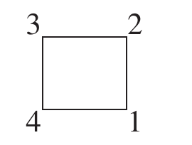

---
A permutation of a set $A$ is a function from $A$ to $A$ that is both one-
to-one and onto. A permutation group of a set $A$ is a set of permutations of $A$ that forms a group under function composition.

---

Although groups of permutations of any nonempty set $A$ of objects
exist, we will focus on the case where $A$ is finite. Furthermore, it is
customary, as well as convenient, to take $A$ to be a set of the form
$\\{1, 2, 3, . . . , n\\}$.

## Array form

$\beta$ of the set $\{1,2,3,4,5,6\}$ given by $\beta(1)=5, \quad \beta(2)=3, \quad \beta(3)=1, \quad \beta(4)=6, \quad \beta(5)=2, \quad \beta(6)=4$ is expressed in array form as

$\beta=\left[\begin{array}{llllll}{1} & {2} & {3} & {4} & {5} & {6} \\\ {5} & {3} & {1} & {6} & {2} & {4}\end{array}\right]$

### Composition

Consider 

$\sigma=\left[\begin{array}{lllll}{1} & {2} & {3} & {4} & {5} \\\ {2} & {4} & {3} & {5} & {1}\end{array}\right]$,
$\gamma=\left[\begin{array}{lllll}{1} & {2} & {3} & {4} & {5} \\\ {5} & {4} & {1} & {2} & {3}\end{array}\right]$

$\gamma \sigma=$
$\left[\begin{array}{ccccc}{1} & {2} & {3} & {4} & {5} \\\ {} & {\downarrow} & {} & {} & {} \\\ {5} & {4} & {1} & {2} & {3} \end{array}\right]$
$\left[\begin{array}{lllll}{1} & {2} & {3} & {4} & {5} \\\ {\downarrow} & {} & {} & {} & {} \\\ {2} & {4} & {3} & {5} & {1}\end{array}\right]$

$=\left[\begin{array}{lllll}{1} & {2} & {3} & {4} & {5} \\\ {4} & {2} & {1} & {3} & {5}\end{array}\right]$

**Examples:** 

- Symmetric Group $S_{n}$: Let $A=\\{1,2, \ldots, n\\} .$ The set
  of all permutations of $A$ is called the symmetric group of degree $n$ and is
  denoted by $S_{n}$ . Elements of $S_{n}$ have the form

  $\alpha=\left[\begin{array}{cccc}{1} & {2} & {\ldots} & {n} \\\ {\alpha(1)} & {\alpha(2)} & {\dots} & {\alpha(n)}\end{array}\right]$

  It is easy to compute the order of $S_{n} .$ There are $n$ choices of $\alpha(1)$ . Once
  $\alpha(1)$ has been determined, there are $n-1$ possibilities for $\alpha(2)$ [since
  $\alpha$ is one-to-one, we must have $\alpha(1) \neq \alpha(2)$]. After choosing $\alpha(2),$ there
  are exactly $n-2$ possibilities for $\alpha(3)$ . Continuing along in this fashion,
  we see that $S_{n} \operatorname{has} n(n-1) \cdot \cdot 3 \cdot 2 \cdot 1=n !$ elements.

- **Symmetries of a Square**, we associate each motion in D with the permutation of the locations of each 4 of the four corners of a square. For example, if we label the four corner
  positions as in the figure below and keep these labels fixed for reference,
  we may describe a 90° counterclockwise rotation by the permutation

   

  $\rho=\left[\begin{array}{llll}{1} & {2} & {3} & {4} \\\ {2} & {3} & {4} & {1}\end{array}\right]$

  whereas a reflection across a horizontal axis yields

  $$
  \phi=\left[\begin{array}{llll}{1} & {2} & {3} & {4} \\\ {2} & {1} & {4} & {3}\end{array}\right]
  $$

  These two elements generate the entire group (that is, every element is
  some combination of the $\rho^{\prime}$ 's and $\phi^{\prime} s ) .$

  When $D_4$ is represented in this way, we see that it is a subgroup
  of $S_4$.

## Cycle Notation

Consider,

$\beta=\left[\begin{array}{llllll}{1} & {2} & {3} & {4} & {5} & {6} \\\ {5} & {3} & {1} & {6} & {2} & {4}\end{array}\right]$

In cycle notation, $\beta$ can be written $(2,3,1,5)(6,4)$ or $(4,6)(3,1,5,2),$
since both of these unambiguously specify the function $\beta .$ An expression of the form $\left(a_{1}, a_{2}, \ldots, a_{m}\right)$ is called a cycle of length $m$ or an
$m-c y c l e .$

A multiplication of cycles can be introduced by thinking of a cycle
as a permutation that fixes any symbol not appearing in the cycle.
Thus, the cycle (4, 6) can be thought of as representing the permutation $\left[\begin{array}{llllll}{1} & {2} & {3} & {4} & {5} & {6} \\\ {1} & {2} & {3} & {6} & {5} & {4}\end{array}\right]$.

Let $\alpha = (13)(27)(456)(8)$ and $\beta = (1237)(648)(5)$. (When the domain consists of single-digit integers, it is common practice to omit the commas between the digits.) $\alpha \beta = ?$

Well, keeping in mind that function composition is done from right to left and that each cycle that does not contain a symbol fixes the symbol, we observe that (5) fixes 1; (648) fixes 1; (1237) sends 1 to 2; (8) fixes 2; (456) fixes 2; (27) sends 2 to 7; and (13) fixes 7. So the net effect of $\alpha \beta$ is to send 1 to 7. Thus, we begin $\alpha \beta = (17 ? ? ?) ? ? ?$ . Now, repeating the entire process beginning with 7, and so on, we have $\alpha \beta=(1732)(48)(56)$

Mathematicians prefer not to
write cycles that have only one entry. In this case, it is understood that any
missing element is mapped to itself. Of course, the identity permutation consists
only of cycles with one entry, so we cannot omit all of these! In this
case, one usually writes just one cycle. For example,
$\varepsilon=\left[\begin{array}{lllll}{1} & {2} & {3} & {4} & {5} \\\ {1} & {2} & {3} & {4} & {5}\end{array}\right]$
can be written as $\varepsilon=(5)$ or $\varepsilon=(1)$

---

**Theorem 5.1:** Every permutation of a finite set can be written as a cycle or as a product of disjoint cycles. (Just give algorithm to find such disjoint cycles)

---

---

**Theorem 5.2:** If the pair of cycles $\alpha=\left(a_{1}, a_{2}, \ldots, a_{m}\right)$ and $\beta=\left(b_{1}, b_{2}, \ldots, b_{n}\right)$
have no entries in common, then $\alpha \beta=\beta \alpha .$ (easy to prove)

---

---

**Theorem 5.3:** The order of a permutation of a finite set written in disjoint cycle
form is the least common multiple of the lengths of the cycles.

**Proof:** First, observe that a cycle of length $n$ has order $n$. (easy to see) Next, suppose that $\alpha$ and $\beta$ are disjoint cycles of lengths $m$
and $n,$ and let $k$ be the least common multiple of $m$ and $n .$ It follows from
Theorem 4.1 that both $\alpha^{k}$ and $\beta^{k}$ are the identity permutation $\varepsilon$ and, since
$\alpha$ and $\beta$ commute, $(\alpha \beta)^{k}=\alpha^{k} \beta^{k}$ is also the identity. Thus, we know by Corollary 2 to Theorem 4.1$\left(a^{k}=e \text { implies that }|a| \text { divides } k\right)$ that the
order of $\alpha \beta-$ let us call it $t$ -must divide $k .$ But then $(\alpha \beta)^{t}=\alpha^{t} \beta^{t}=\varepsilon$
so that $\alpha^{t}=\beta^{-t} .$ However, it is clear that if $\alpha$ and $\beta$ have no common
symbol, the same is true for $\alpha^{t}$ and $\beta^{-t},$ since raising a cycle to a power
does not introduce new symbols. But, if $\alpha^{t}$ and $\beta^{-t}$ are equal and have
no common symbol, they must both be the identity, because every symbol in $\alpha^{t}$ is fixed by $\beta^{-t}$ and vice versa (remember that a symbol not ap-
pearing in a permutation is fixed by the permutation). It follows, then,
that both $m$ and $n$ must divide $t$ . This means that $k$ , the least common
multiple of $m$ and $n$ , divides $t$ also. This shows that $k=t$ . 

Thus far, we have proved that the theorem is true in the cases
where the permutation is a single cycle or a product of two disjoint
cycles. The general case involving more than two cycles can be handled in an analogous way.

---

**Examples:** 

- To determine the orders of the 7! = 5040 elements of $S_{7},$ we need only consider the possible disjoint cycle structures of the
  elements of $S_{7} .$ For convenience, we denote an $n$ -cycle by $(n) .$ Then, arranging all possible disjoint cycle structures of elements of $S_{7}$
  according to longest cycle lengths left to right, we have

  $(\underline{7})$

  $(\underline{6})(\underline{1})$

  $(\underline{5})(\underline{2})$

  $(\underline{5})(\underline{1})(\underline{1})$

  $(\underline{4})(\underline{3})$

  $(\underline{4})(\underline{2})(\underline{1})$

  $(\underline{4})(\underline{1})(\underline{1})(\underline{1})$

  $(\underline{3})(\underline{3})(\underline{1})$

  $(\underline{3})(\underline{2})(\underline{2})$

  $(\underline{3})(\underline{2})(\underline{1})(\underline{1})$

  $(\underline{3})(\underline{1})(\underline{1})(\underline{1})(\underline{1})$

  $(\underline{2})(\underline{2})(\underline{2})(\underline{1})$

  $(\underline{2})(\underline{2})(\underline{1})(\underline{1})(\underline{1})$

  $(\underline{2})(\underline{1})(\underline{1})(\underline{1})(\underline{1})(\underline{1})$
  
  $(\underline{1})(\underline{1})(\underline{1})(\underline{1})(\underline{1})(\underline{1})(\underline{1})$

  Now, from Theorem 5.3 we see that the orders of the elements of $S_7$
  are 7, 6, 10, 5, 12, 4, 3, 2, and 1.

- We determine the number of elements of $S_{7}$ of order 3. By Theorem $5.3,$ we need only count the number of permutations of
  the forms $\left(a_{1} a_{2} a_{3}\right)$ and $\left(a_{1} a_{2} a_{3}\right)\left(a_{4} a_{5} a_{6}\right) .$ In the first case consider the
  triple $a_{1} a_{2} a_{3} .$ Clearly there are $7 \cdot 6 \cdot 5$ such triples. But this product counts the permutation $\left(a_{1} a_{2} a_{3}\right)$ three times (for example, it counts $134,$
  $341,413$ as distinct triples whereas the cycles $(134),(341),$ and $(413)$
  are the same group element). Thus, the number of permutations in $S_{7}$ for the form $\left(a_{1} a_{2} a_{3}\right)$ is $(7 \cdot 6 \cdot 5) / 3=70$ . For elements of $S_{7}$ of the form
  $\left(a_{1} a_{2} a_{3}\right)\left(a_{4} a_{5} a_{6}\right)$ there are $(7 \cdot 6 \cdot 5) / 3$ ways to create the first cycle and
  $(4 \cdot 3 \cdot 2) / 3$ to create the second cycle but the product of $(7 \cdot 6 \cdot 5) / 3$ and $(4 \cdot 3 \cdot 2) / 3$ to create the second cycle but the product of $(7 \cdot 6 \cdot 5) / 3$ and
  $(4 \cdot 3 \cdot 2) / 3$ counts $\left(a_{1} a_{2} a_{3}\right)\left(a_{4} a_{5} a_{6}\right)$ and $\left(a_{4} a_{5} a_{6}\right)\left(a_{3} a_{2} a_{1}\right)$ as distinct when
  they are equal group elements. Thus, the number of elements in $S_{7}$ for the
  form $\left(a_{1} a_{2} a_{3}\right)\left(a_{4} a_{5} a_{6}\right)$ is $(7 \cdot 6 \cdot 5)(4 \cdot 3 \cdot 2) /(3 \cdot 3 \cdot 2)=280 .$ This gives us 350 elements of order 3 in $S_{7}$.

---

**Theorem 5.4:** Every permutation in $S_{n}, n>1,$ is a product of 2 -cycles.

**Proof:** First, note that the identity can be expressed as (12)(12), and so it is a product of 2-cycles. By Theorem 5.1, we know that every permutation can be written in the form $\left(a_{1} a_{2} \cdots a_{k}\right)\left(b_{1} b_{2} \cdots b_{t}\right) \cdots\left(c_{1} c_{2} \cdots c_{s}\right)$ A direct computation shows that this is the same as

$\left(a_{1} a_{k}\right)\left(a_{1} a_{k-1}\right) \cdots\left(a_{1} a_{2}\right)\left(b_{1} b_{t}\right)\left(b_{1} b_{t-1}\right) \cdots\left(b_{1} b_{2}\right)$

$\cdots\left(c_{1} c_{s}\right)\left(c_{1} c_{s-1}\right) \cdot \cdot \cdot\left(c_{1} c_{2}\right)$

This completes the proof.

*Note: Many authors call two length cycles as transpositions*

---

---

**Lemma:** If $\varepsilon=\beta_{1} \beta_{2} \cdots \beta_{r},$ where the $\beta^{\prime}$ s are 2 -cycles, then $r$ is even.

**Proof:** Clearly, $r \neq 1,$ since a 2 -cycle is not the identity. If $r=2,$ we are done. So, we suppose that $r>2,$ and we proceed by induction. Suppose that the rightmost 2 -cycle is $(a b) .$ Then, since $(i j)=(j i)$ , the
product $\beta_{r-1} \beta_{r}$ can be expressed in one of the following forms shown
on the right:

$\begin{aligned} \varepsilon &=(a b)(a b) \\\ (a b)(b c) &=(a c)(a b) \\\ (a c)(c b) &=(b c)(a b) \\\ (a b)(c d) &=(c d)(a b) \end{aligned}$

If the first case occurs, we may delete $\beta_{r-1} \beta_{r}$ from the original product
to obtain $\varepsilon=\beta_{1} \beta_{2} \cdots \beta_{r-2},$ and therefore, by the Second Principle of
Mathematical Induction, $r-2$ is even. In the other three cases, we
replace the form of $\beta_{r-1} \beta_{r}$ on the right by its counterpart on the left to obtain a new product of $r $ 2-cycles that is still the identity, but where
the rightmost occurrence of the integer $a$ is in the second-from-the-
rightmost 2 -cycle of the product instead of the rightmost 2 -cycle. We now
repeat the procedure just described with $\beta_{r-2} \beta_{r-1},$ and, as before, we obtain a product of $(r-2)$ $2$ -cycles equal to the identity or a new product
of $r $ 2-cycles, where the rightmost occurrence of $a$ is in the third 2 -cycle
from the right. Continuing this process, we must obtain a product of
$(r-2)$ - -cycles equal to the identity, because otherwise we have a product equal to the identity in which the only occurrence of the integer $a$ is in the
leftmost 2 -cycle, and such a product does not fix $a,$ whereas the identity
does. Hence, by the Second Principle of Mathematical Induction, $r-2$ is even, and $r$ is even as well.

---

---

**Theorem 5.5:** If a permutation $\alpha$ can be expressed as a product of an even (odd) number of 2-cycles, then every decomposition of a into a product of
2-cycles must have an even (odd) number of 2-cycles. In symbols, if $\alpha=\beta_{1} \beta_{2} \cdots \beta_{r} \quad$ and $\quad \alpha=\gamma_{1} \gamma_{2} \cdots \gamma_{s}$ where the $\beta$'s and the $\gamma$'s are 2-cycles, then $r$ and $s$ are both even or both odd.

**Proof:** Observe that $\beta_{1} \beta_{2} \cdots \beta_{r}=\gamma_{1} \gamma_{2} \cdots \gamma_{s}$ implies

$$
\begin{array}{l}{\varepsilon=\gamma_{1} \gamma_{2} \cdots \gamma_{s} \beta_{r}^{-1} \ldots \beta_{2}^{-1} \beta_{1}^{-1}} \\\ {\quad=\gamma_{1} \gamma_{2} \cdots \gamma_{s} \beta_{r} \cdots \beta_{2} \beta_{1}}\end{array}
$$

since a 2-cycle is its own inverse. Thus, we have $s + r$ is even. It follows that $r$ and $s$ are both even or both odd.

---

A permutation that can be expressed as a product of an even number
of 2-cycles is called an even permutation. A permutation that can
be expressed as a product of an odd number of 2-cycles is called an
odd permutation.

---

**Theorem 5.6:** The set of even permutations in $S_{n}$ forms a subgroup of $S_{n}$ (easy to prove)

---

The group of even permutations of $n$ symbols is denoted by $A_{n}$ and is
called the alternating group of degree $n .$

---

**Theorem 5.7:** For $n>1, A_{n}$ has order $n ! / 2$

**Proof:** For each odd permutation $\alpha,$ the permutation $(12) \alpha$ is even and, by the cancellation property in groups, $(12) \alpha \neq(12) \beta$ when $\alpha \neq \beta$ . Thus,
there are at least as many even permutations as there are odd ones. On the
other hand, for each even permutation $\alpha$ , the permutation $(12) \alpha$ is odd and
$(12) \alpha \neq(12) \beta$ when $\alpha \neq \beta .$ Thus, there at least as many odd permutations as there are even ones. It follows that there are equal numbers of even and odd permutations. since $\left|S_{n}\right|=n !,$ we have $\left|A_{n}\right|=n ! / 2$

---
